# Introduction to Large Language Models(LLMs)

---

## 🎯 Learning Objectives

By the end of this unit, you should be able to:

- [ ]  Define what a Language Model (LM) is and explain its fundamental purpose
- [ ]  Understand the concept of tokenization and probability distributions in text
- [ ]  Distinguish between "Large" and traditional language models
- [ ]  Trace the evolution from rule-based systems to modern LLMs
- [ ]  Identify real-world applications of language models in everyday technology
- [ ]  Comprehend the basic principles behind different LM architectures

---

## 🧠 Deep Dive: What is a Language Model?

## 📖 **Definition**

> Language Model (LM): A computational model that calculates the probability of a given sequence of text. It fundamentally answers: "How probable is this piece of text?" - P(text)
> 

## 🎭 **Real-World Analogy: The Literature Professor**

💭 Imagine you're a literature professor who has read millions of books, newspapers, and articles over decades. When students show you different sentences, you can instantly tell which ones sound natural:

**Student writes:** "I went to the store to buy groceries"

→ **Your brain:** "Perfect! Very natural. 9.5/10" ✅

**Student writes:** "Store went groceries I to buy the"

→ **Your brain:** "This is completely unnatural. 0.5/10" ❌

**This is exactly what a Language Model does** - it acts like that experienced professor, but uses mathematical probability calculations instead of intuition.

## 🧮 **Mathematical Foundation**

  **Chain Rule of Probability:**

```
P(w₁, w₂, ..., wₙ) = P(w₁) × P(w₂|w₁) × P(w₃|w₁,w₂) × ...
```

## 🔄 **How Language Models Work - Flowchart**

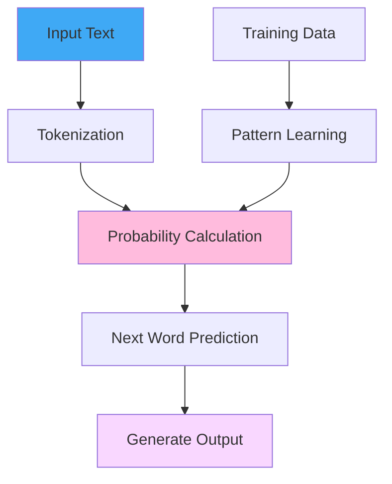

---

## 🔍 Tokenization: Breaking Language Into Digestible Pieces

## 📖 **Definition**

> Tokenization: The process of breaking text into smaller units called tokens. Modern LLMs use subword tokenization rather than word-level tokenization.
> 

## 🥕➡️🍲 **Real-World Analogy: The Food Processor**

Think of tokenization like a food processor that chops vegetables for cooking:

- **Whole vegetables (Original text):** "Tokenization example"
- **Chopped pieces (Tokens):** ["Token", "ization", "example"]

Just like how a chef needs ingredients in manageable pieces to cook, an LM needs text broken into smaller units (tokens) to understand and process language effectively.

## 🔄 **Tokenization Process Flowchart**

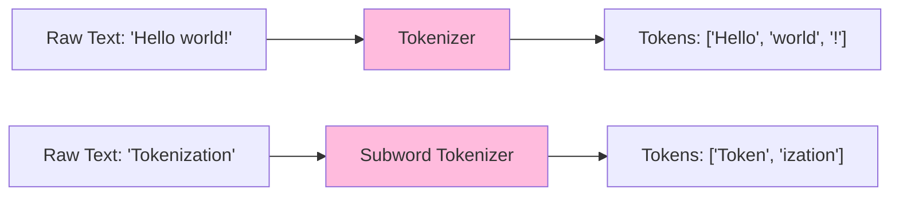

**Why subword tokenization?**

- **Handles unknown ingredients:** Break down unseen words into familiar parts
- **Efficient cooking:** Smaller, consistent pieces process more evenly
- **Works with any cuisine:** Universal approach for different languages

---

## 🚀 What Makes a Language Model "Large"?

## 📖 **Definition**

> Large Language Model (LLM): A language model with billions of parameters trained on massive datasets (terabytes of text), capable of few-shot learning and emergent behaviors.
> 

## 🏘️ **Real-World Analogy: Building a City vs. Building a House**

**Traditional Language Models = Building a House:**

- Small team (few million parameters)
- Local materials (limited training data)
- Simple tools (basic algorithms)
- **Result:** Cozy but limited functionality

**Large Language Models = Building a Metropolis:**

- Massive workforce (billions of parameters)
- Global supply chain (internet-scale training data)
- Advanced machinery (transformer architecture)
- **Result:** Complex, versatile, can handle almost anything

## 📊 **The Two Pillars of "Largeness"**

## 1. **Model Size (Parameters)**

| Model | Parameters | Year | Analogy |
| --- | --- | --- | --- |
| GPT-1 | 117M | 2018 | Small town |
| GPT-2 | 1.5B | 2019 | City district |
| GPT-3 | 175B | 2020 | Major metropolis |
| GPT-4 | ~1.8T | 2023 | Global megacity |
| **GPT-5** | ~50T | 2025 | **Galactic civilization** |

## 2. **Training Data Scale**

| Dataset | Size | Source |
| --- | --- | --- |
| BookCorpus | 5GB | Books |
| C4 | 800GB | CommonCrawl |
| The Pile | 800GB | Mixed sources |
| ROOTS | 1.6TB | Multilingual web |

## 🔄 **Scale Growth Flowchart**

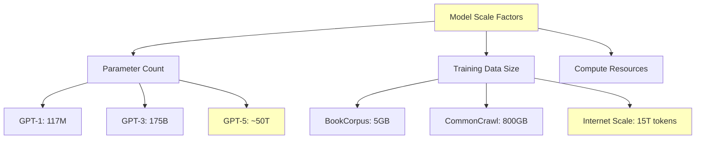

## 👨**Training Data Analogy: Learning to Cook**

- **Traditional Model:** Learned from 1 cookbook (BookCorpus - 5GB)
- **Modern LLM:** Learned from every cookbook, food blog, restaurant review, and cooking show on the internet (15 trillion tokens)

**This is like the difference between:**

- A home cook who learned from grandmother's recipes ➡️ Traditional LM
- A world-class chef who traveled globally, studying every cuisine ➡️ Modern LLM

---

## 🌍 Real-World Applications: LMs Everywhere

## 🔄 **LLM Applications Ecosystem**

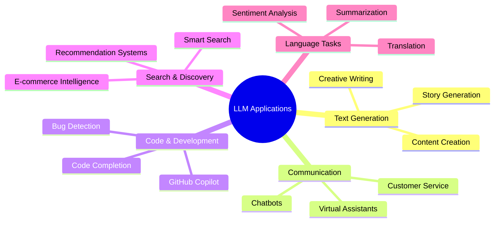

## 📱 **1. Your Phone's Keyboard - The Mind Reader Secretary**

**Real-World Analogy:** Like having a secretary who can read your mind.

**You type:** "I'll meet you at the"

**LM thinks:** *"Based on millions of conversations, people usually meet at cafes, restaurants, airports, or offices"*

**Suggestions appear:** [cafe, airport, office, restaurant]

## 🛍️ **2. E-commerce Search - The Smart Translator**

**Amazon Example - The Thoughtful Shopping Assistant:**

- **Customer searches:** "shoes for pregnant women"
- **Traditional system thinks:** *"Find shoes with 'pregnant' keyword"* ❌
- **LM thinks:** *"Pregnant women need safety → slip-resistant shoes"* ✅
- **Result:** Shows slip-resistant shoes, comfort shoes, supportive footwear

## 💻 **3. Code Generation - The Coding Buddy**

**GitHub Copilot Example:**

```python
*# You write a comment:# Function to calculate character count in a string
# LM generates:*
def calculateCharacters(text):
    return len(text)
```

**Real-World Analogy:** Like having a coding buddy who's memorized every programming tutorial and Stack Overflow answer ever created.

## 🔄 **Application Flow Process**

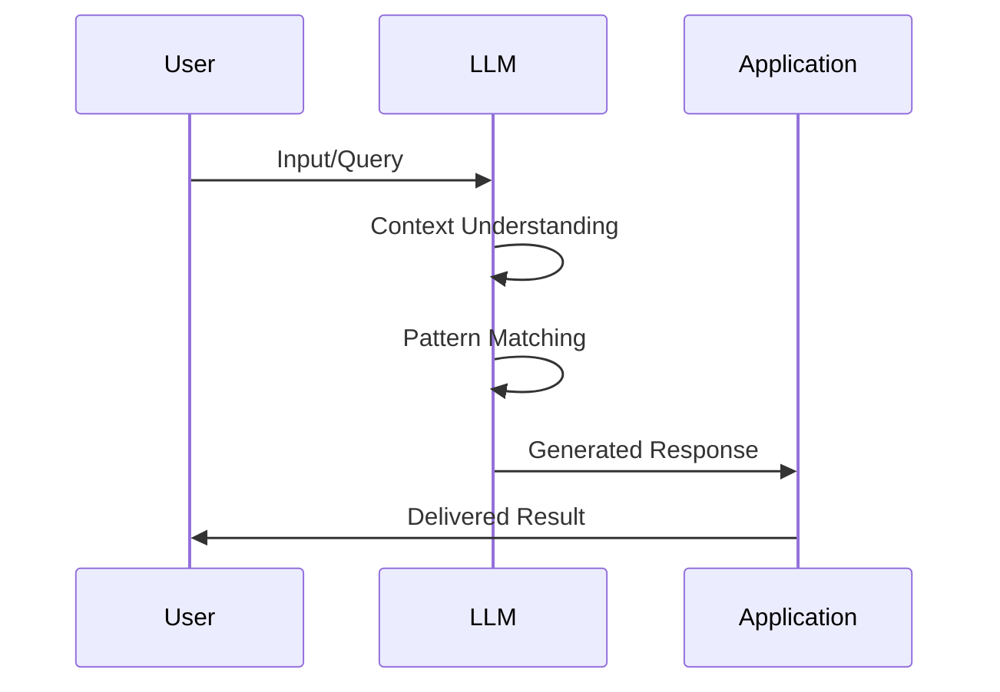

---

## 📈 Evolution Timeline: From Caveman to AI Genius

## 📖 **Key Definitions**

> Rule-Based Systems: Early AI systems using hand-crafted if-else logic
> 
> 
> **N-gram Models:** Statistical models using word frequency patterns
> 
> **Neural Language Models:** Models using neural networks for pattern learning
> 
> **Transformers:** Architecture using self-attention for parallel processing
> 

## 🚶➡️🚀 **Real-World Analogy: Evolution of Transportation**

## 🔄 **Complete Evolution Flowchart**

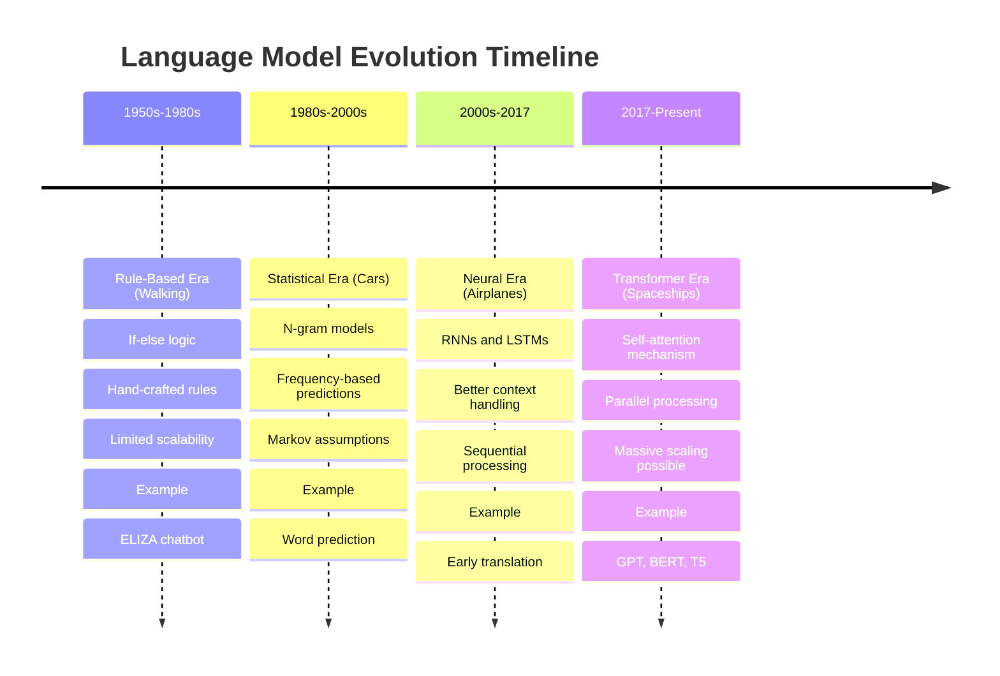

## 🕰️ **Era 1: Rule-Based (1950s-1980s) - Walking**

**Method:** Hand-crafted if-else rules

```python
if "Ohio" in user_input:
    return "Ohio is a state in the US"
else:
    return "I don't understand"
```

**Analogy:** Like walking everywhere - reliable for short distances but doesn't scale.

**Limitations:**

- Extremely rigid (can only go where paths exist)
- Breaks easily with unexpected input
- Cannot handle language complexity

## 📊 **Era 2: Statistical N-grams (1980s-2000s) - Cars**

**Method:** Count word frequencies and calculate probabilities

## 🕵️**Real-World Analogy: The Pattern Detective**

Imagine a detective who solves crimes by looking at patterns:

- **Sees:** "Bank robbery" mentioned 1000 times in news
- **Also sees:** "Bank robbery" followed by "investigation" 800 times
- **Predicts:** After "Bank robbery", next word is probably "investigation"

## 🔄 **N-gram Model Process**

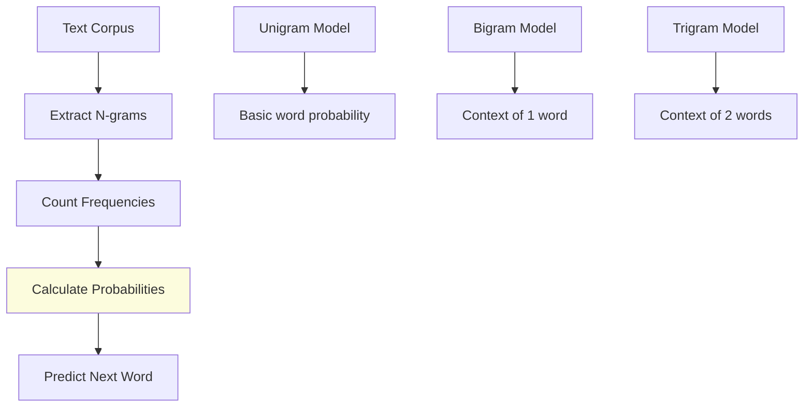

**N-gram Examples:**

```
Text: "I have a dog whose name is Lucy. I have two cats."

Bigram Analysis:
P(have|I) = count("I have")/count("I") = 2/2 = 1.0
P(two|have) = count("have two")/count("have") = 1/2 = 0.5
```

**Fun Shakespeare Generation Example:**

- **1-gram (Unigram):** "nocablseploahohiolet servhjosecsevwenmn" (gibberish)
- **2-gram (Bigram):** "Why dost stand forth thy canopy" (better!)
- **3-gram (Trigram):** "Fly, and will rid me these news of price" (almost coherent!)
- **4-gram:** "It cannot be but so." (very coherent!)

**Limitations:** Like a car that can only drive on roads it's seen before - breaks down on new routes.

## 🧠 **Era 3: Neural Networks (1990s-2017) - Airplanes**

**Method:** Use neural networks to learn patterns

**Analogy:** Like airplanes that can fly over obstacles but still need runways and are limited by weather conditions.

## 🔄 **Neural Language Model Architecture**

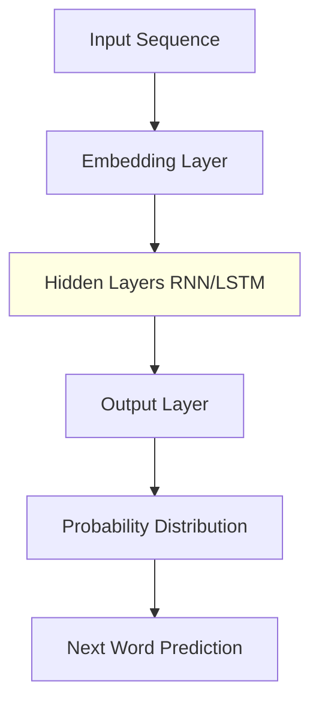

**Advantages:**

- Can handle sequences of varying lengths
- Learns complex patterns
- Better generalization

**Limitations:**

- Still struggled with very long sequences
- Training was slow (sequential processing)
- Vanishing gradient problems

## 🚀 **Era 4: Transformers (2017-Present) - Spaceships**

**The Game Changer:** "Attention Is All You Need" paper

## 📚 **Real-World Analogy: The Omniscient Librarian**

Imagine a magical librarian who can:

- **Instantly access** any book in any library worldwide
- **Connect related concepts** across different books simultaneously
- **Understand context** from the entire collection at once

**This is exactly what self-attention does** - it can look at any part of the input text simultaneously and understand how all parts relate to each other.

## 🔄 **Transformer Self-Attention Process**

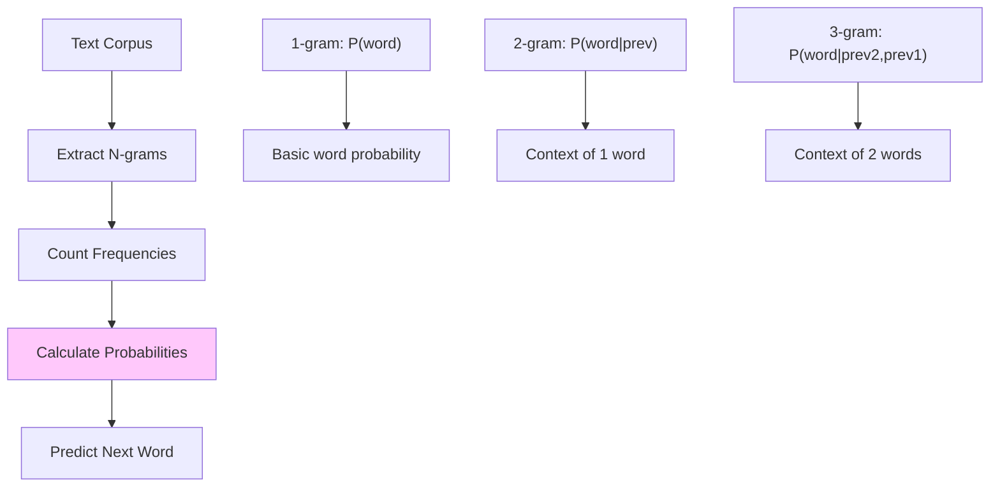

---

## 🏗️ The Three Transformer Architectures

## 📖 **Definitions**

> GPT (Generative Pre-trained Transformer): Decoder-only architecture optimized for text generation
> 
> 
> **BERT (Bidirectional Encoder Representations from Transformers):** Encoder-only architecture for text understanding
> 
> **T5 (Text-to-Text Transfer Transformer):** Encoder-decoder architecture for any text-to-text task
> 

## 🔬 **Real-World Analogy: Different Types of Experts**

| Architecture | Real-World Expert | Specialization | Best For | Examples |
| --- | --- | --- | --- | --- |
| **GPT (Decoder-only)** | Creative Writer | Storytelling, generation | Text creation, completion | GPT-3, GPT-4, LLaMA |
| **BERT (Encoder-only)** | Reading Comprehension Teacher | Understanding, analysis | Q&A, classification | BERT, RoBERTa |
| **T5 (Encoder-Decoder)** | Universal Translator | Transformation | Any text-to-text task | T5, BART |

## 🔄 **Architecture Comparison Flowchart**

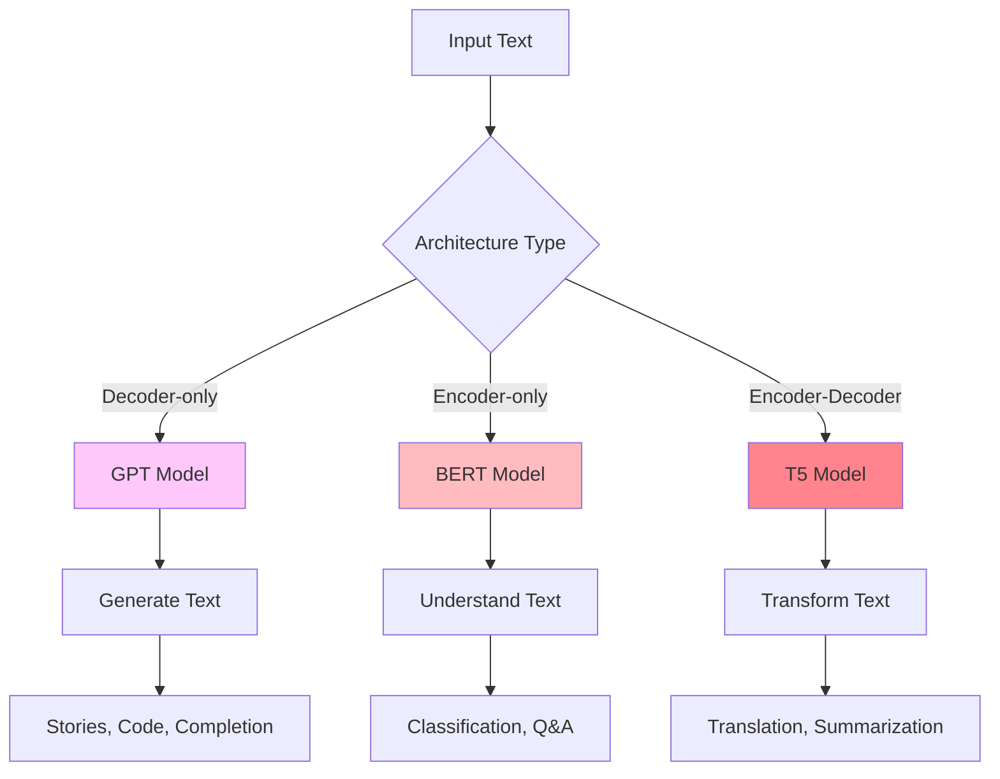

---

## 🌟 The ChatGPT Moment: The Tipping Point

## 📱 **Real-World Analogy: The Smartphone Moment**

Remember the shift from flip phones to smartphones? That's what happened with ChatGPT:

- **Before:** AI was a research curiosity
- **After:** AI became an everyday tool for billions

## 📊 **Current AI Performance vs Humans**

| Task | AI Performance | Human Performance | Winner |
| --- | --- | --- | --- |
| Image Recognition | 95.1% | 94.9% | AI wins by 0.2% 🏆 |
| Speech Recognition | 95.8% | 94.1% | AI wins by 1.7% 🏆 |
| Language Understanding | 89.2% | 87.4% | AI wins by 1.8% 🏆 |
| Handwriting Recognition | 97.8% | 97.0% | AI wins by 0.8% 🏆 |

## 🔄 **The LLM Revolution Timeline**

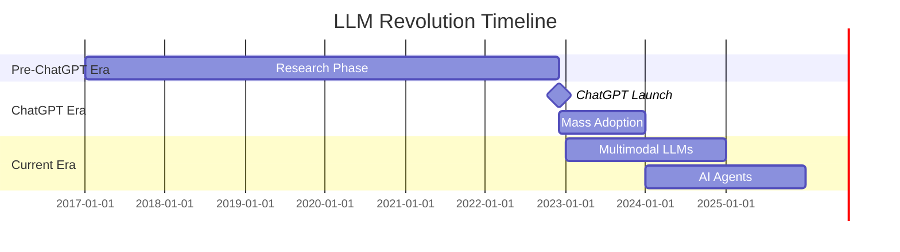

---

## 🔄 LLM Training Process: From Data to Intelligence

## 🔄 **Complete Training Pipeline**

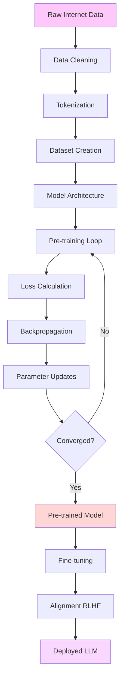

## 🍳 **Real-World Analogy: Training a Master Chef**

1. **Raw Data Collection** = Gathering ingredients from around the world
2. **Data Cleaning** = Washing and preparing ingredients
3. **Training** = Years of practice cooking every cuisine
4. **Fine-tuning** = Specializing in specific dishes
5. **Alignment** = Learning customer preferences and dietary restrictions

---

## 🎯 Key Insights & Real-World Impact

## 💡 **The Core Understanding**

1. **Language Models are sophisticated pattern recognition machines** - They're like that friend who's great at finishing your sentences because they've heard similar conversations millions of times.
2. **Scale unlocks magical abilities** - It's like the difference between a local store clerk (helpful but limited) and a world-renowned expert consultant (can handle almost anything).
3. **Transformers changed everything** - Like the invention of the internet, it connected everything to everything else instantly.

## 🔗 **What This Means for Your Daily Life**

- **Your phone** predicts your texts better than ever
- **Your search results** understand what you actually mean, not just keywords
- **Your code suggestions** feel like having a senior developer beside you
- **Your writing assistants** can adapt to any style or tone you need

## 🚀 **The Journey Ahead**

We're still in the early days of the LLM revolution. Key areas to explore:

- **Multimodal models** (text + images + audio)
- **Reasoning capabilities** (Chain of Thought, Tool usage)
- **Efficiency improvements** (smaller models, faster inference)
- **Safety and alignment** (building helpful, harmless AI)

## 🔄 **Future Trends Prediction**

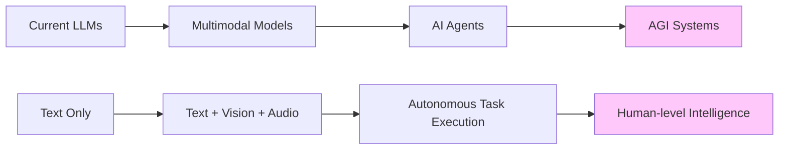

---

## 🧪 Control Questions & Deep Reflection

## **Question 1:** *Using the "literature professor" analogy, explain why LLMs can generate coherent text.*

Just like a literature professor who has read millions of texts can intuitively know what words and phrases flow naturally together, an LLM uses statistical patterns learned from vast amounts of text to predict the most probable next words. The "professor's intuition" is the LLM's probability calculations based on patterns it has seen countless times.

**Key insight:** The coherence comes from the model having seen similar patterns billions of times during training, allowing it to predict statistically likely continuations.

## **Question 2:** *Why is the "food processor" analogy appropriate for tokenization?*

Tokenization breaks text into manageable pieces (tokens) just like a food processor chops ingredients into uniform, workable pieces. Both processes:

- Make raw input more digestible for processing
- Create consistent, manageable units
- Enable better handling of complex or unknown elements
- Are essential preparation steps before the main work begins

**Key insight:** Just as cooking requires properly prepared ingredients, language modeling requires properly tokenized text.

## **Question 3:** *Explain the progression from "walking" to "spaceships" in the evolution of language models.*

This analogy represents increasing sophistication and capabilities:

- **Walking (Rule-based):** Slow, limited range, predictable paths only
- **Cars (N-grams):** Faster, but confined to existing roads (seen patterns)
- **Airplanes (Neural):** Can overcome obstacles but still weather-dependent (limited context)
- **Spaceships (Transformers):** Can go anywhere, unlimited range, breakthrough technology (global attention)

**Key insight:** Each era represents a fundamental breakthrough in how we process and understand language, with transformers being the "space age" of NLP.

---

## 🔍 Personal Understanding & Insights

## **My Key Realizations:**

1. **Language models are fundamentally prediction engines** - They don't "understand" language in human terms, but excel at pattern recognition and statistical prediction.
2. **Scale unlocks emergent abilities** - Many capabilities (like few-shot learning, reasoning) only emerge at large scales, which wasn't predictable from smaller models.
3. **The democratization of AI** - Modern LLMs have made sophisticated language understanding accessible to anyone, not just researchers with massive compute resources.

## **Real-World Impact:**

The progression from rule-based systems to modern LLMs represents one of the fastest technological transformations in history. In just 6 years (2017-2023), we went from research papers to billions of people using AI daily.

## 🔄 **My Learning Journey Map**

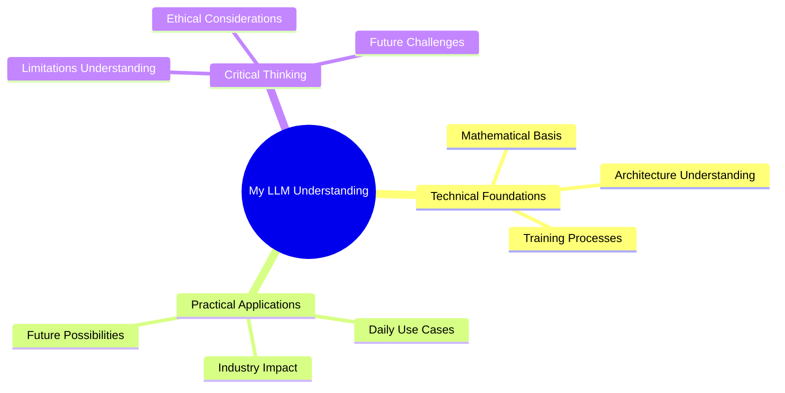

---