# Natural Language Processing

## 🎯 **Learning Objectives**

By the end of this unit, you’ll master:
- **Why NLP is fundamentally challenging** and what makes human language unique
- **Regular expressions** as powerful pattern matching tools for text processing
- **Complete text preprocessing pipelines** from raw text to clean tokens
- **N-gram language models** with mathematical foundations and practical implementation
- **Evaluation techniques** including perplexity, smoothing, and model comparison
- **Real-world applications** and limitations of statistical NLP approaches

---

## 🧠 **What is Natural Language Processing?**

### **Definition & Core Concept**

**Natural Language Processing (NLP)** is a branch of artificial intelligence that focuses on enabling computers to understand, interpret, and generate human language in a way that is both meaningful and useful.

**🎭 Real-World Analogy: The Universal Translator**

Imagine you’re hired as the world’s first **Universal Translator** at the United Nations. Your job is to understand and translate between any two human languages in real-time. You quickly realize this isn’t just about swapping words - you need to:

- **Understand context**: “I’ll meet you at the bank” (river bank vs. financial bank?)
- **Handle ambiguity**: “Flying planes can be dangerous” (flying planes is dangerous vs. planes that are flying can be dangerous)
- **Process emotions**: Detect sarcasm, excitement, anger, or subtle humor
- **Navigate culture**: Idioms like “it’s raining cats and dogs” don’t translate literally
- **Manage evolution**: Language constantly changes with new slang, terms, and meanings

**That’s exactly what NLP systems are trying to achieve!**

### **Natural Language Definition & Characteristics**

**Natural Language** refers to any language that humans use for everyday communication, which has evolved naturally through use and repetition without conscious planning or premeditation.

```mermaid
graph TD
    A[Human Communication Systems] --> B[Natural Languages]
    B --> C[Spoken Languages]
    B --> D[Written Languages]
    B --> E[Sign Languages]

    C --> C1[Hindi हिंदी]
    C --> C2[English]
    C --> C3[Mandarin 中文]
    C --> C4[Spanish Español]
    C --> C5[7000+ Others]

    F[Key Characteristics] --> G[Evolves Naturally]
    F --> H[Context Dependent]
    F --> I[Culturally Rich]
    F --> J[Ambiguous by Design]
    F --> K[Creative & Generative]
    F --> L[Learned Unconsciously]

    style B fill:#4fc3f7
    style F fill:#ba68c8
    style G fill:#ffb7
    style H fill:#81c784
    style I fill:#f06292
    style J fill:#ef5350
    style K fill:#66bb6a
    style L fill:#a5d6
```



**🧠 Key Insight:** Unlike programming languages (precise, unambiguous, designed), natural languages are:
- **Organically evolved** over thousands of years
- **Beautifully messy** with exceptions, irregularities, and creative uses
- **Context-dependent** where meaning changes based on situation
- **Culturally embedded** with layers of social and historical meaning

### **NLP vs. Programming Languages Comparison**

| Aspect | Programming Languages | Natural Languages |
| --- | --- | --- |
| **Ambiguity** | Zero tolerance | Ambiguity is a feature |
| **Context** | Explicit syntax | Heavy context dependence |
| **Evolution** | Controlled updates | Constant organic change |
| **Errors** | Immediate failure | Graceful degradation |
| **Creativity** | Fixed constructs | Infinite creative potential |
| **Learning** | Formal study | Natural acquisition |

---

## 🎬 **Historical Timeline: From Dreams to Reality**

### **The Turing Test (1950): The Original AI Challenge**

**Definition:** The Turing Test is a test of a machine’s ability to exhibit intelligent behavior equivalent to, or indistinguishable from, that of a human.

**🎭 Real-World Analogy: The Ultimate Impersonation Game**

Picture the most sophisticated game of charades ever invented:

**The Setup:**
- **Room A**: You (the judge) with a computer terminal
- **Room B**: A human trying to help you
- **Room C**: A computer trying to fool you
- **The Challenge**: Can you tell which is which through conversation only?

**Alan Turing’s Revolutionary Question:**
> *“Instead of asking ‘Can machines think?’, let’s ask ‘Can machines fool humans into thinking they can think?’”*

**Modern Reality Check (2024-2025):**
- **ChatGPT** can fool many people in specific conversations
- **Claude** demonstrates sophisticated reasoning capabilities
- **GPT-4** passes many professional exams
- But we still debate: Is this “intelligence” or very sophisticated pattern matching?

### **ELIZA (1964-1967): The Accidental Therapist**

**Definition:** ELIZA was one of the first chatbot computer programs, created to demonstrate the superficiality of communication between humans and machines by mimicking a Rogerian psychotherapist.

**🎭 Real-World Analogy: The Reflective Mirror**

ELIZA worked like a skilled therapist who mostly reflects your statements back as questions, making YOU do the thinking while feeling heard and understood.

**The First Chatbot that Changed Everything**

```
ELIZA: Hello. I am ELIZA. How can I help you today?
HUMAN: Men are all alike.
ELIZA: What is the connection, do you suppose?
HUMAN: They're always bugging us about something or other.
ELIZA: Can you think of a specific example?
HUMAN: Well, my boyfriend made me come here.
ELIZA: Your boyfriend made you come here?
HUMAN: He says I'm depressed much of the time.
ELIZA: I am sorry to hear that you are depressed.
```

**ELIZA’s Simple Magic:**
1. **Pattern matching**: “I am X” → “How long have you been X?”
2. **Question deflection**: Transform statements into questions
3. **Keyword triggers**: “Mother” → “Tell me more about your family”
4. **Default responses**: “That’s interesting. Please continue.”

**🧠 The ELIZA Effect:** People formed emotional connections with ELIZA despite knowing it was a computer! This revealed how readily humans project intelligence and understanding onto machines that simply follow rules.

### **Evolution Timeline Visualization**


---

## 🚧 **Why is NLP So Extraordinarily Challenging?**

### **Ambiguity: The Shape-Shifting Challenge**

**Definition:** Ambiguity in natural language refers to the phenomenon where a word, phrase, or sentence can be interpreted in multiple ways, leading to uncertainty about the intended meaning.

**🎭 Real-World Analogy: Fighting a Shape-Shifting Monster**

Imagine you’re a detective trying to catch a criminal who changes appearance, personality, and even identity based on:
- **Who’s looking at them** (context sensitivity)
- **Where they are** (situational meaning)
- **What time it is** (temporal changes)
- **Who they’re with** (social context)

That’s ambiguity in language - it shape-shifts constantly!

### **The Four Levels of Linguistic Ambiguity**


### **Detailed Ambiguity Examples**

### **1. Lexical Ambiguity: The Word Chameleon**

**Definition:** Lexical ambiguity occurs when a single word has multiple meanings or senses, and the intended meaning must be determined from context.

Words change meaning like chameleons change color based on context:

| Word | Context 1 | Meaning 1 | Context 2 | Meaning 2 |
| --- | --- | --- | --- | --- |
| **bank** | “Meet me at the bank” | 🏦 Financial institution | “Sit by the river bank” | 🏞️ Riverbank |
| **bark** | “The dog’s bark was loud” | 🐕 Dog sound | “Tree bark is rough” | 🌳 Tree covering |
| **bat** | “Baseball bat broke” | ⚾ Sports equipment | “The bat flew away” | 🦇 Flying mammal |
| **date** | “What’s today’s date?” | 📅 Calendar day | “We went on a date” | 💕 Romantic meeting |

### **2. Syntactic Ambiguity: The Structure Puzzle**

**Definition:** Syntactic ambiguity arises when a sentence can be parsed in multiple ways, leading to different structural interpretations and meanings.

Same words, different sentence structures, completely different meanings:

**Example 1: The Duck Mystery**

```
"I saw her duck."
```

**Interpretation A:** I saw her pet duck (duck = noun)

```
[I]     [saw]   [her duck]
Subject  Verb   Object
```

**Interpretation B:** I saw her duck down (duck = verb)

```
[I]       [saw]   [her]   [duck]
Subject   Verb    Object   Verb
```

**Example 2: The Telescope Enigma**

```
"I can see a man with a telescope."
```

**Who has the telescope?**
- **Interpretation A:** The man has the telescope
- **Interpretation B:** I’m using the telescope to see the man

### **3. Semantic Ambiguity: The Meaning Maze**

**Definition:** Semantic ambiguity occurs when the relationships between words or concepts in a sentence can be interpreted in multiple ways, leading to different meanings.

**Example: The Hungry Chicken**

```
"The chicken is ready to eat."
```

**Two completely different scenarios:**
- **Scenario A:** The chicken (as food) is cooked and ready to be eaten
- **Scenario B:** The chicken (as animal) is hungry and ready to eat food

### **4. Pragmatic Ambiguity: The Context Game**

**Definition:** Pragmatic ambiguity involves uncertainty about the intended meaning of an utterance based on context, social conventions, and implied meanings rather than literal interpretation.

**🎭 Real-World Analogy: Reading Between the Lines**

Like understanding that “Nice weather we’re having” from a stranger in an elevator isn’t really about weather - it’s social lubrication!

**Examples:**

```
"Can you pass the salt?"
→ Not asking about your ability, it's a polite request

"Do you have the time?"
→ Not asking about possession, asking for current time

"It's getting cold in here."
→ Might be a hint to close the window or turn up heat
```

### **Context Sensitivity: The Chameleon Effect**

**Definition:** Context sensitivity refers to how the meaning of words, phrases, or sentences changes depending on the surrounding linguistic context, situational context, or cultural background.

```mermaid
graph LR
    A[Word: run] --> B{Context?}

    B -->|Sports| C["🏃 To move quickly on foot"]
    B -->|Business| D["🏢 To operate/manage"]
    B -->|Computing| E["💻 To execute a program"]
    B -->|Politics| F["🗳️ To campaign for office"]
    B -->|Theater| G["🎭 Duration of performances"]
    B -->|Stockings| H["🧦 A tear or ladder"]
    B -->|Water| I["🚰 To flow"]
    B -->|Color| J["🎨 To bleed or spread"]

    style A fill:#ffd54f
    style B fill:#42a5f5
    style C fill:#66bb6a
    style D fill:#42a5f5
    style E fill:#ab47bc
    style F fill:#ef5350
    style G fill:#f06292
    style H fill:#ff7043
    style I fill:#26c6da
    style J fill:#9ccc65
```



**🧠 Key Insight:** The word “run” has over 600 different meanings in English! Context is everything in natural language understanding.

### **Cultural & Temporal Complexity**

**Definition:** Cultural and temporal complexity refers to how language meaning varies across different cultures, time periods, and social groups, making universal interpretation challenging.

**🎭 Real-World Analogy: The Time-Traveling Cultural Ambassador**

Imagine you’re a cultural ambassador who must understand not just different cultures, but also how language changes across time periods:

**Cultural Variations:**

```
"Rubber" in American English = Eraser
"Rubber" in British English = Condom
Same word, different continents, completely different meanings!
```

**Temporal Changes:**

```
"Gay" in 1920 = Happy, cheerful
"Gay" in 2020 = Homosexual
"Sick" in 1990 = Ill, unwell
"Sick" in 2020 = Awesome, cool (slang)
```

### **The Grammar Complexity Challenge**

**Definition:** Grammar complexity refers to the diverse structural rules and patterns that different languages use to organize words, phrases, and sentences, creating challenges for universal language processing systems.

Different languages organize information in radically different ways:

```mermaid
graph TD
    A[Language Types] --> B[Word Order Patterns]

    B --> B1[SVO - Subject Verb Object]
    B --> B2[SOV - Subject Object Verb]
    B --> B3[VSO - Verb Subject Object]
    B --> B4[Free Word Order]

    B1 --> B1A["English: 'The cat chased the mouse'"]
    B2 --> B2A["Japanese: '猫が ネズミを 追いかけた'(Cat mouse chased)"]
    B3 --> B3A["Welsh: 'Gwelodd y gath y llygoden'(Saw the cat the mouse)"]
    B4 --> B4A["Hindi: Flexible with case markers'बिल्ली ने चूहे को पकड़ा'"]

    C[Complexity Factors] --> C1[Case Systems]
    C --> C2[Verb Conjugations]
    C --> C3[Gender/Number Agreement]
    C --> C4[Tonal Variations]

    style A fill:#42a5f5
    style C fill:#ba68c8
    style B1 fill:#66bb6a
    style B2 fill:#ff43
    style B3 fill:#f06292
    style B4 fill:#ff7043
```



**Example: “The cat chased the mouse” in different languages:**

| Language | Structure | Word Order | Notes |
| --- | --- | --- | --- |
| **English** | The cat chased the mouse | SVO | Fixed word order |
| **Japanese** | 猫が ネズミを 追いかけた | SOV | Particle markers |
| **Hindi** | बिल्ली ने चूहे को पकड़ा | Flexible | Case markers |
| **Arabic** | طاردت القطة الفأر | VSO | Verb-initial |

---

## 🛠️ **Regular Expressions: The Text Processing Swiss Army Knife**

### **Definition & Core Concept**

**Regular Expressions (Regex)** are sequences of characters that define search patterns, used for matching, locating, and manipulating text strings based on specific rules and patterns.

**🎭 Real-World Analogy: The Pattern Detective Sherlock Holmes**

Think of regular expressions as **Sherlock Holmes with a magnifying glass** examining text for patterns. Just as Holmes can spot tiny clues others miss, regex can find complex patterns in massive amounts of text with surgical precision.

**Holmes says:** *“You see, but you do not observe. The pattern is there - 3 digits, followed by a dash, followed by 4 digits. Phone number, obviously!”*

### **Basic Pattern Matching Building Blocks**


### **Character Classes: The Building Blocks**

| Pattern | Matches | Example Matches | Doesn’t Match |
| --- | --- | --- | --- |
| `[abc]` | Any of a, b, or c | a, b, c | d, e, f |
| `[^abc]` | Anything BUT a, b, c | d, e, f, 1, 2 | a, b, c |
| `[a-z]` | Any lowercase letter | a, m, z | A, M, Z, 1 |
| `[A-Z]` | Any uppercase letter | A, M, Z | a, m, z, 1 |
| `[0-9]` | Any single digit | 0, 5, 9 | a, A, ! |
| `[a-zA-Z0-9]` | Any alphanumeric | a, Z, 5 | !, @, # |
| `.` | Any single character | a, Z, 5, !, space | (nothing) |

### **Quantifiers: How Many Times?**

**Definition:** Quantifiers specify how many times a character or group should be matched in the target string.


### **Real-World Pattern Examples**

### **Email Address Validation**

```
Basic: [a-zA-Z0-9]+@[a-zA-Z0-9]+\.[a-zA-Z]{2,}

Matches:
✅ john@example.com
✅ user123@test.org
❌ @example.com (no username)
❌ john@.com (no domain)
```

### **Phone Number Patterns**

```
US Phone: \(?[0-9]{3}\)?[-. ]?[0-9]{3}[-. ]?[0-9]{4}

Matches:
✅ (555) 123-4567
✅ 555-123-4567
✅ 555.123.4567
✅ 5551234567
✅ 555 123 4567
```

### **URL Detection**

```
Simple URL: https?://[a-zA-Z0-9.-]+\.[a-zA-Z]{2,}

Matches:
✅ http://example.com
✅ https://www.google.com
✅ https://sub.domain.org
❌ ftp://files.com (not http/https)
```

### **Advanced Regex Features**

### **Groups and Capturing**

**Definition:** Groups allow you to treat multiple characters as a single unit and capture the matched text for later use.

```
Pattern: ([A-Z][a-z]+) ([A-Z][a-z]+)
Text: "John Smith"
Capture Group 1: "John"
Capture Group 2: "Smith"
```

### **Alternation (OR)**

**Definition:** Alternation allows you to match one pattern OR another pattern.

```
Pattern: cat|dog|bird
Matches: "I have a cat", "dogs are loyal", "bird watching"
```

### **Word Boundaries**

**Definition:** Word boundaries help match whole words rather than partial matches within larger words.

```
Pattern: \bcat\b
✅ Matches: "The cat sat" (whole word)
❌ No match: "concatenate" (part of word)
```

---

## 🔧 **Text Processing Pipeline: From Chaos to Clean Data**

### **Definition & Core Concept**

**Text Processing Pipeline** refers to a series of sequential steps that transform raw, unstructured text into clean, structured, and analyzable data suitable for machine learning algorithms.

**🎭 Real-World Analogy: The Food Processing Factory**

Imagine a sophisticated food processing factory that takes raw, messy ingredients (raw text with typos, mixed languages, emojis, HTML tags) and transforms them into clean, packaged products (structured tokens) ready for consumption by machine learning models.


### **Step 1: Text Segmentation**

**Definition:** Text segmentation is the process of dividing continuous text into meaningful units such as sentences, words, or other linguistic segments.

**🎭 Real-World Analogy: The Paragraph Detective**

Like a detective who needs to identify where one crime ends and another begins, text segmentation determines sentence and word boundaries.

### **Sentence Segmentation Challenges**

**Simple Case:**

```
"Hello world. How are you?" → ["Hello world.", "How are you?"]
```

**Complex Cases:**

```
"Dr. Smith went to the U.S.A. in Jan. 2021. He loved it."
```

**Challenges:**
- **Abbreviations**: Dr., U.S.A., Jan. (periods don’t mean sentence end)
- **Decimal numbers**: “The price is $12.99. That’s expensive.”
- **URLs**: “Visit www.example.com. It’s great!”

### **Word Segmentation Challenges**

**English (Space-separated):**

```
"Hello world" → ["Hello", "world"]  # Easy!
```

**Chinese (No spaces):**

```
"我爱北京天安门" → ["我", "爱", "北京", "天安门"]
# Possible segmentations:
# ["我", "爱", "北京天安门"] (I love Beijing Tiananmen)
# ["我爱", "北京", "天安门"] (My love Beijing Tiananmen)
```

**German (Compound words):**

```
"Donaudampfschifffahrtsgesellschaftskapitän"
→ ["Donau", "dampf", "schiff", "fahrts", "gesellschafts", "kapitän"]
(Danube steam ship travel company captain)
```

### **Step 2: Tokenization - Breaking Text into Manageable Pieces**

**Definition:** Tokenization is the process of breaking down text into individual units called tokens, which can be words, subwords, or characters, depending on the chosen granularity.

**🎭 Real-World Analogy: The LEGO Block Sorter**

Think of tokenization as sorting a mixed box of LEGO blocks into organized containers - each piece (token) goes into the right category for easy access later.

### **Types of Tokenization**


### **Tokenization Challenges & Solutions**

**Challenge 1: Contractions**

```
Input: "I can't believe it's working!"
Option A: ["I", "can't", "believe", "it's", "working", "!"]
Option B: ["I", "can", "'t", "believe", "it", "'s", "working", "!"]
Option C: ["I", "cannot", "believe", "it", "is", "working", "!"]
```

**Challenge 2: Hyphenated Words**

```
Input: "State-of-the-art technology"
Option A: ["State-of-the-art", "technology"]
Option B: ["State", "-", "of", "-", "the", "-", "art", "technology"]
Option C: ["State", "of", "the", "art", "technology"]
```

**Challenge 3: URLs and Special Entities**

```
Input: "Visit https://www.example.com for more info"
Desired: ["Visit", "https://www.example.com", "for", "more", "info"]
```

### **Step 3: Normalization - Making Text Consistent**

**Definition:** Normalization is the process of converting text into a canonical (standard) form by applying various transformations to reduce variations and inconsistencies.

**🎭 Real-World Analogy: The Style Editor**

Like a magazine editor who ensures consistent style across all articles - same font, spacing, capitalization rules - normalization ensures consistent text representation.

### **Common Normalization Steps**

```mermaid
graph TD
    A[Normalization Tasks] --> B[Case Normalization]
    A --> C[Punctuation Handling]
    A --> D[Accent Removal]
    A --> E[Spelling Correction]
    A --> F[Number Normalization]

    B --> B1["iPhone → iphone"]
    B --> B2["USA → usa"]

    C --> C1["Remove: !@#$%"]
    C --> C2["Keep semantic: can't → cannot"]

    D --> D1["café → cafe"]
    D --> D2["naïve → naive"]

    E --> E1["teh → the"]
    E --> E2["recieve → receive"]

    F --> F1["2021 → "]
    F --> F2["$100 → "]

    style A fill:#42a5f5
    style B fill:#66bb6a
    style C fill:#ffca28
    style D fill:#f06292
    style E fill:#ab47bc
    style F fill:#26c6da
```



### **Before and After Normalization**

| Original | After Normalization | Reason |
| --- | --- | --- |
| `"iPhone"` | `"iphone"` | Case consistency |
| `"U.S.A."` | `"usa"` | Remove periods |
| `"café"` | `"cafe"` | Remove accents |
| `"won't"` | `"will not"` | Expand contractions |
| `"2020"` | `""` | Number abstraction |
| `"$50.99"` | `""` | Currency abstraction |

### **Step 4: Morphological Analysis**

**Definition:** Morphological analysis is the process of analyzing words to identify their component parts (morphemes) including roots, prefixes, suffixes, and their grammatical relationships.

**🎭 Real-World Analogy: The Word Archaeologist**

Think of words as ancient artifacts with multiple layers of meaning. A word archaeologist carefully examines each artifact to understand:
- **The core/root** (stem): The fundamental meaning
- **The decorations** (prefixes/suffixes): Modifications to the meaning
- **The context** (part of speech): How it’s used in sentences

### **Stemming vs. Lemmatization**

```mermaid
graph TD
    A[Word Analysis] --> B[Stemming]
    A --> C[Lemmatization]

    B --> B1[Crude chopping]
    B --> B2[Fast but inaccurate]
    B --> B3[Rules-based]

    C --> C1[Intelligent reduction]
    C --> C2[Slow but accurate]
    C --> C3[Dictionary-based]

    D[Examples] --> E[Stemming Results]
    D --> F[Lemmatization Results]

    E --> E1["running → runn"]
    E --> E2["better → better"]
    E --> E3["meeting → meet"]

    F --> F1["running → run"]
    F --> F2["better → good"]
    F --> F3["meeting → meeting (noun) or meet (verb)"]

    style B fill:#ef5350
    style C fill:#66bb6a
    style E fill:#66e
    style F fill:#26c6da
```



### **Stemming Examples (Porter Stemmer)**

| Original | Stemmed | Notes |
| --- | --- | --- |
| `running` | `run` | Remove -ing |
| `flies` | `fli` | Remove -es, handle y→i |
| `died` | `die` | Remove -d |
| `meetings` | `meet` | Remove -ings |
| `beautiful` | `beauti` | Remove -ful |

**🧠 Key Insight:** Stemming is fast but crude - it might create non-words. Lemmatization is slower but produces actual dictionary words.

### **Step 5: Part-of-Speech (POS) Tagging**

**Definition:** Part-of-Speech tagging is the process of assigning grammatical categories (such as noun, verb, adjective) to each word in a text based on its definition and context.

**🎭 Real-World Analogy: The Grammar Detective**

Like a detective who identifies the role each person plays in a crime (victim, suspect, witness), POS tagging identifies the grammatical role each word plays in a sentence.

### **Common POS Tags**

| Tag | Meaning | Example Words | Example in Context |
| --- | --- | --- | --- |
| **NN** | Noun (singular) | dog, house, love | “The **dog** barked” |
| **NNS** | Noun (plural) | dogs, houses | “The **dogs** barked” |
| **VB** | Verb (base form) | run, eat, think | “I **run** daily” |
| **VBD** | Verb (past tense) | ran, ate, thought | “I **ran** yesterday” |
| **JJ** | Adjective | big, red, happy | “A **big** dog” |
| **RB** | Adverb | quickly, very | “Run **quickly**” |
| **DT** | Determiner | the, a, an | “**The** dog” |
| **IN** | Preposition | in, on, at | “**In** the house” |

### **POS Tagging Example**

```
Sentence: "The quick brown fox jumps over the lazy dog."

Tagged:
The/DT quick/JJ brown/JJ fox/NN jumps/VBZ over/IN the/DT lazy/JJ dog/NN ./.
```

### **Step 6: Named Entity Recognition (NER)**

**Definition:** Named Entity Recognition is the process of identifying and classifying named entities (such as persons, organizations, locations, dates) in text into predefined categories.

**🎭 Real-World Analogy: The VIP Identifier**

Like a security guard at an exclusive event who must identify VIPs (celebrities, politicians, important guests) among regular attendees, NER identifies important entities in text.

### **Common Named Entity Types**


### **NER Example**

```
Sentence: "Apple Inc. was founded by Steve Jobs in Cupertino in 1976."

Tagged:
[Apple Inc.]ORG was founded by [Steve Jobs]PERSON in [Cupertino]LOC in [1976]DATE.
```

---

## 📊 **N-Gram Language Models: The Statistical Foundation**

### **Definition & Core Concept**

**N-Gram Language Models** are probabilistic models that predict the next word in a sequence based on the previous n-1 words, using statistical patterns learned from training data.

**🎭 Real-World Analogy: The Context-Aware Fortune Teller**

Imagine a fortune teller who predicts your next word based on the last few words you’ve spoken. The more context (previous words) they remember, the better their predictions become:

- **1-gram (Unigram)**: “Based on all words ever spoken, the next word will probably be ‘the’”
- **2-gram (Bigram)**: “You just said ‘New’, so the next word is probably ‘York’”
- **3-gram (Trigram)**: “You just said ‘New York’, so the next word is probably ‘City’”
- **4-gram**: “You just said ‘New York City’, so the next word is probably ‘is’ or ‘has’”

### **The Markov Assumption: Limited Memory**

**Definition:** The Markov Assumption is a simplifying assumption that the probability of a future state depends only on the current state and a limited number of previous states, not the entire history.

**🧠 Key Insight:** N-gram models make a simplifying assumption called the **Markov Assumption**:

> “The probability of the next word depends only on the previous n-1 words, not the entire history.”
> 

```
Full History: P(word₅ | word₁, word₂, word₃, word₄)
Bigram Approximation: P(word₅ | word₄)
Trigram Approximation: P(word₅ | word₃, word₄)
```

**🎭 Real-World Analogy: The Goldfish Memory**

Like a goldfish that can only remember the last few seconds, n-gram models only “remember” the last n-1 words when predicting the next word.

### **N-Gram Model Types & Mathematical Foundations**

```mermaid
graph TD
    A[N-Gram Models] --> B[Unigram n=1]
    A --> C[Bigram n=2]
    A --> D[Trigram n=3]
    A --> E[4-gram n=4]
    A --> F[5-gram n=5]

    B --> B1["P(wᵢ) = count(wᵢ)/N"]
    B --> B2["Independence assumption"]
    B --> B3["No context used"]

    C --> C1["P(wᵢ|wᵢ₋₁) = count(wᵢ₋₁,wᵢ)/count(wᵢ₋₁)"]
    C --> C2["One word context"]
    C --> C3["Most common practical model"]

    D --> D1["P(wᵢ|wᵢ₋₂,wᵢ₋₁) = count(wᵢ₋₂,wᵢ₋₁,wᵢ)/count(wᵢ₋₂,wᵢ₋₁)"]
    D --> D2["Two word context"]
    D --> D3["Good balance of context/data"]

    E --> E1["Three word context"]
    E --> E2["Requires more data"]

    F --> F1["Four word context"]
    F --> F2["Data sparsity issues"]

    style A fill:#42a5f5
    style B fill:#ffca28
    style C fill:#66bb6a
    style D fill:#f06292
    style E fill:#ef5350
    style F fill:#ef5350
```



### **Mathematical Foundation Deep Dive**

### **Unigram Model (1-gram)**

**Definition:** A unigram model predicts each word independently based only on its overall frequency in the training corpus, ignoring all context.

```
P(sentence) = P(w₁) × P(w₂) × P(w₃) × ... × P(wₙ)
P(wᵢ) = count(wᵢ) / total_word_count
```

**Characteristics:**
- ✅ **Simple**: No context needed
- ❌ **Naive**: Ignores word order completely
- **Use case**: Baseline model, spam detection

### **Bigram Model (2-gram)**

**Definition:** A bigram model predicts each word based on the immediately preceding word, using conditional probabilities.

```
P(sentence) = P(w₁) × P(w₂|w₁) × P(w₃|w₂) × ... × P(wₙ|wₙ₋₁)
P(wᵢ|wᵢ₋₁) = count(wᵢ₋₁, wᵢ) / count(wᵢ₋₁)
```

**Characteristics:**
- ✅ **Practical**: Good balance of simplicity and performance
- ✅ **Fast**: Efficient computation
- ❌ **Limited**: Only one word of context

### **Trigram Model (3-gram)**

**Definition:** A trigram model predicts each word based on the two immediately preceding words, providing more context than bigram models.

```
P(wᵢ|wᵢ₋₂, wᵢ₋₁) = count(wᵢ₋₂, wᵢ₋₁, wᵢ) / count(wᵢ₋₂, wᵢ₋₁)
```

**Characteristics:**
- ✅ **Better context**: Two words of history
- ✅ **More coherent**: Better text generation
- ❌ **Data hungry**: Needs larger corpora

### **Concrete Example: Building a Bigram Model**

**Training Corpus:**

```
"I love cats. I love dogs. Cats love fish. Dogs love bones."
```

**Step 1: Extract Bigrams**

```
 I, I love, love cats, cats
 I, I love, love dogs, dogs
 Cats, Cats love, love fish, fish
 Dogs, Dogs love, love bones, bones
```

**Step 2: Count Bigrams**
| Bigram          | Count |
|——–———|———|
| `I`                  | 2          |
| `I love`        | 2          |
| `love cats` | 1            |
| `love dogs` | 1            |
| `love fish` | 1            |
| `love bones` | 1          |        
| `Cats love` | 1            |
| `Dogs love` | 1            |

**Step 3: Calculate Probabilities**

```
P(love | I) = count("I love") / count("I") = 2/2 = 1.0
P(cats | love) = count("love cats") / count("love") = 1/4 = 0.25
P(dogs | love) = count("love dogs") / count("love") = 1/4 = 0.25
```

**Step 4: Generate Text**

```
Start with: "I"
Next word probabilities:
- P(love | I) = 1.0 → Choose "love"

Current: "I love"
Next word probabilities:
- P(cats | love) = 0.25
- P(dogs | love) = 0.25
- P(fish | love) = 0.25
- P(bones | love) = 0.25
→ Randomly choose one (e.g., "dogs")

Result: "I love dogs"
```

### **Shakespeare Generation: Quality by N-Gram Order**

**🎭 Real-World Analogy: The Aspiring Playwright**

Imagine four aspiring playwrights trying to write like Shakespeare, each with different amounts of Shakespeare’s work memorized:


### **The Data Sparsity Problem**

**Definition:** The data sparsity problem refers to the challenge that as n-gram order increases, the number of possible n-gram combinations grows exponentially, making most combinations absent from any finite training corpus.

**🎭 Real-World Analogy: The Expanding Library Problem**

Imagine you’re building a library of every possible sentence:

- **1-gram library**: 50,000 books (vocabulary size)
- **2-gram library**: 50,000² = 2.5 billion books
- **3-gram library**: 50,000³ = 125 trillion books
- **4-gram library**: 50,000⁴ = 6.25 × 10¹⁸ books

**The Problem**: Even with massive corpora, most of these “books” (n-grams) are empty!


---

## ⚖️ **Language Model Evaluation: Measuring Success**

### **Perplexity: The Surprise-O-Meter**

**Definition:** Perplexity is an evaluation metric for language models that measures how well a probability model predicts a sample, with lower values indicating better predictive performance.

**🎭 Real-World Analogy: The Poker Player’s Surprise Level**

Think of perplexity as measuring how “surprised” a professional poker player is by the cards being dealt:

- **Low perplexity (good model)**: “I expected this hand - makes sense given what I’ve seen”
- **High perplexity (bad model)**: “This hand totally surprised me - I had no idea!”

A good language model should rarely be “surprised” by the next word in a sentence.

### **Mathematical Definition of Perplexity**

```
Perplexity(W) = 2^(-1/N × Σ log₂ P(wᵢ))

Where:
- W = word sequence w₁, w₂, ..., wₙ
- N = number of words
- P(wᵢ) = probability assigned to word wᵢ by the model
```

**Intuitive Interpretation:**
- **Lower perplexity = Better model** (less surprised by test data)
- **Higher perplexity = Worse model** (more confused by test data)
- **Perplexity ≈ average branching factor** (how many equally likely choices)

### **Perplexity Examples**


### **Perplexity Calculation Example**

**Test Sentence**: “I love cats”
**Vocabulary Size**: 10,000 words

**Model A (Good):**

```
P("I") = 0.1
P("love" | "I") = 0.05
P("cats" | "love") = 0.02

Perplexity = 2^(-1/3 × (log₂(0.1) + log₂(0.05) + log₂(0.02)))
           = 2^(-1/3 × (-3.32 + -4.32 + -5.64))
           = 2^(4.43) = 21.6
```

**Model B (Poor):**

```
P("I") = 0.001
P("love" | "I") = 0.001
P("cats" | "love") = 0.001

Perplexity = 2^(-1/3 × 3 × log₂(0.001))
           = 2^(-1/3 × 3 × -9.97)
           = 2^(9.97) = 1000
```

### **Comparative Perplexity Results**

| Model Type | Typical Perplexity | Interpretation |
| --- | --- | --- |
| **Perfect Oracle** | 1 | Never wrong |
| **Excellent (GPT-4)** | 10-20 | Very good predictions |
| **Good Trigram** | 50-150 | Decent performance |
| **Simple Bigram** | 100-300 | Basic competence |
| **Unigram** | 500-1000 | Poor, no context |
| **Random Baseline** | ~10,000 | Vocabulary size |

### **The Zero Probability Catastrophe**

**Definition:** The zero probability catastrophe occurs when a language model assigns zero probability to a word sequence, making it impossible to compute perplexity and causing mathematical failures.

**🎭 Real-World Analogy: The Mathematical Black Hole**

Imagine a scenario where a single impossible event (like dividing by zero) destroys your entire calculation. That’s what happens with zero probabilities in language models.

**The Problem:**

```
Test sentence: "I love pizza"
Training never saw: "love pizza"

P("pizza" | "love") = 0
→ P(entire sentence) = 0
→ log₂(0) = -∞
→ Perplexity = ∞ (undefined!)
```

**Consequences:**
1. **Perplexity becomes undefined** (can’t divide by zero)
2. **Model completely fails** on any unseen n-gram
3. **No way to compare models** with infinite perplexity
4. **System crashes** in practical applications

---

## 🎯 **Smoothing: Handling Unseen Data**

### **The Fundamental Smoothing Principle**

**Definition:** Smoothing techniques redistribute probability mass from observed events to unobserved events to ensure that no n-gram has exactly zero probability.

**🎭 Real-World Analogy: The Optimistic Insurance Agent**

Think of smoothing like an insurance agent who:
- **Reserves some probability** for events that haven’t happened yet
- **Redistributes risk** from frequent events to rare ones
- **Ensures coverage** for unexpected situations
- **Maintains system stability** even with surprises

### **Add-One (Laplace) Smoothing**

**Definition:** Add-One smoothing (also called Laplace smoothing) adds one count to every possible n-gram, ensuring no n-gram has zero probability.

**The Gentle Optimist Approach**

**Formula:**

```
P_smoothed(wᵢ | wᵢ₋₁) = (count(wᵢ₋₁, wᵢ) + 1) / (count(wᵢ₋₁) + V)

Where V = vocabulary size
```

**🎭 Real-World Analogy: The Polite Host**

Like a host who sets one extra place at every dinner party “just in case” an unexpected guest arrives, Add-One smoothing reserves a little probability for every possible word.

### **Before and After Add-One Smoothing**

**Original Counts:**

```
"I want": count = 827, P = 827/2533 = 0.33
"I eat": count = 9, P = 9/2533 = 0.0036
"I sleep": count = 0, P = 0/2533 = 0 ← Problem!
```

**After Add-One Smoothing (V = 20,000):**

```
"I want": P = (827+1)/(2533+20000) = 828/22533 = 0.037
"I eat": P = (9+1)/(2533+20000) = 10/22533 = 0.00044
"I sleep": P = (0+1)/(2533+20000) = 1/22533 = 0.000044 ← Fixed!
```

**Trade-offs:**
- ✅ **Eliminates zero probabilities**
- ✅ **Simple to implement**
- ❌ **Too generous** to unseen events
- ❌ **Takes too much probability** from seen events

### **Good-Turing Smoothing: The Frequency of Frequencies**

**Definition:** Good-Turing smoothing estimates the probability of unseen events by analyzing the frequency distribution of observed events, particularly those that occur exactly once.

**🎭 Real-World Analogy: The Species Discovery Biologist**

A biologist studying a new ecosystem asks: “Based on how many species I’ve seen once, twice, etc., how many species exist that I haven’t seen at all?”

**Key Insight:** Use the count of words that appear exactly once to estimate the probability mass of words that appear zero times.

**The Good-Turing Formula:**

```
P*(words_with_count_0) = N₁ / N

Where:
N₁ = number of words that appear exactly once
N = total number of word tokens
```

### **Good-Turing Example**

**Corpus Analysis:**

```
Words appearing 0 times: ??? (unknown)
Words appearing 1 time: 1,500 words
Words appearing 2 times: 800 words
Words appearing 3 times: 400 words
Total tokens: 100,000
```

**Estimate:**

```
P*(unseen words) = 1,500 / 100,000 = 0.015 = 1.5%
```

**Interpretation:** About 1.5% of probability mass should be reserved for words we’ve never seen.

### **Interpolation: The Ensemble Approach**

**Definition:** Interpolation combines multiple n-gram models of different orders using weighted averages to create a more robust prediction.

**🎭 Real-World Analogy: The Committee of Experts**

Instead of relying on one expert (trigram only), form a committee where:
- **The specialist** (trigram): Knows specific contexts very well
- **The generalist** (bigram): Has broader but shallower knowledge

- **The fallback** (unigram): Always has some opinion

**Linear Interpolation Formula:**

```
P_interpolated(wᵢ | wᵢ₋₂, wᵢ₋₁) = λ₃P₃(wᵢ | wᵢ₋₂, wᵢ₋₁) +
                                  λ₂P₂(wᵢ | wᵢ₋₁) +
                                  λ₁P₁(wᵢ)

Where λ₃ + λ₂ + λ₁ = 1
```

### **Interpolation Example**

**Scenario:** Predict next word after “New York”

```
Trigram: P("City" | "New York") = 0.8 (high confidence)
Bigram: P("City" | "York") = 0.3 (medium confidence)
Unigram: P("City") = 0.001 (low confidence)

Weights: λ₃ = 0.7, λ₂ = 0.2, λ₁ = 0.1

Final: P = 0.7×0.8 + 0.2×0.3 + 0.1×0.001 = 0.56 + 0.06 + 0.0001 = 0.62
```

### **Back-off Models: The Hierarchical Fallback**

**Definition:** Back-off models use higher-order n-grams when available and “back off” to lower-order n-grams when higher-order information is unavailable or unreliable.

**🎭 Real-World Analogy: The Emergency Contact System**

Like an emergency contact system that tries:
1. **First**: Call your spouse (trigram)
2. **If no answer**: Call your parents (bigram)

3. **If still no answer**: Call emergency services (unigram)

**Katz Back-off Algorithm:**

```
If trigram count > threshold:
    Use trigram probability
Else if bigram count > threshold:
    Use discounted bigram probability
Else:
    Use discounted unigram probability
```

### **Smoothing Method Comparison**

```mermaid
graph TD
    A[Smoothing Methods] --> B[Add-One/Laplace]
    A --> C[Good-Turing]
    A --> D[Interpolation]
    A --> E[Back-off]

    B --> B1[✅ Simple]
    B --> B2[❌ Too generous to unseen]
    B --> B3[Use: Quick prototypes]

    C --> C1[✅ Principled approach]
    C --> C2[❌ Complex implementation]
    C --> C3[Use: Research applications]

    D --> D1[✅ Combines all orders]
    D --> D2[❌ Requires parameter tuning]
    D --> D3[Use: High performance systems]

    E --> E1[✅ Efficient]
    E --> E2[❌ Hard cutoff decisions]
    E --> E3[Use: Production systems]

    style A fill:#42a5f5
    style B fill:#ffca28
    style C fill:#66bb6a
    style D fill:#f06292
    style E fill:#26c6da
```



---

## 📈 **Advanced Evaluation Techniques**

### **Train/Validation/Test Split Strategy**

**Definition:** Dataset splitting is the practice of dividing available data into separate portions for training models, tuning hyperparameters, and evaluating final performance to ensure unbiased assessment.

**🎭 Real-World Analogy: The Three-Stage Education System**

Think of model training like education:

```mermaid
graph TD
    A[Complete Dataset] --> B[Training Set 60-80%]
    A --> C[Validation Set 10-20%]
    A --> D[Test Set 10-20%]

    B --> B1[📚 Classroom Learning]
    B --> B2[Learn patterns & rules]
    B --> B3[Teacher provides feedback]

    C --> C1[📝 Practice Exams]
    C --> C2[Tune study strategies]
    C --> C3[Identify weak areas]

    D --> D1[🎓 Final Exam]
    D --> D2[Real performance measure]
    D --> D3[Never seen before]

    E[Model Training Process] --> B
    F[Hyperparameter Tuning] --> C
    G[Final Evaluation] --> D

    style B fill:#66bb6a
    style C fill:#ee66
    style D fill:#ef5350
```



**Critical Rules:**
1. **Training set**: Model learns from this data
2. **Validation set**: Tune hyperparameters, early stopping decisions
3. **Test set**: **NEVER TOUCH** until final evaluation
4. **Information leakage**: Any peeking at test set invalidates results

### **Cross-Validation for Robust Evaluation**

**Definition:** Cross-validation is a resampling technique that divides data into multiple folds, training and testing the model on different combinations to obtain more reliable performance estimates.

**🎭 Real-World Analogy: The Rotating Jury System**

Like a legal system that uses different jury combinations to ensure fair trials, cross-validation uses different data combinations for robust evaluation.


### **Intrinsic vs. Extrinsic Evaluation**

### **Intrinsic Evaluation: Internal Health Check**

**Definition:** Intrinsic evaluation measures model performance on the language modeling task itself, using metrics directly related to the model’s primary objective.

**🎭 Real-World Analogy: The Medical Check-up**

Like a doctor running blood tests, checking blood pressure, and measuring vitals to assess overall health, intrinsic evaluation measures model performance on language modeling tasks directly.

**Examples:**
- **Perplexity**: How surprised is the model?
- **Cross-entropy loss**: Direct optimization target
- **Accuracy**: Next word prediction accuracy

### **Extrinsic Evaluation: Real-World Performance**

**Definition:** Extrinsic evaluation measures how well the language model performs when used as a component in downstream applications or real-world tasks.

**🎭 Real-World Analogy: Job Performance Review**

Like evaluating an employee based on actual work output rather than test scores, extrinsic evaluation measures how well the language model performs in real applications.

**Examples:**
- **Machine Translation**: BLEU score on translation quality
- **Speech Recognition**: Word Error Rate (WER)
- **Question Answering**: F1 score on correct answers
- **Text Classification**: Classification accuracy

### **Evaluation Metrics Deep Dive**

### **Classification Metrics**

**Definition:** Classification metrics are quantitative measures used to evaluate the performance of classification models by comparing predicted labels with true labels.

**Confusion Matrix Breakdown:**

```mermaid
graph TD
    A[Confusion Matrix] --> B[True Positives TP]
    A --> C[True Negatives TN]
    A --> D[False Positives FP]
    A --> E[False Negatives FN]
    
    B --> B1[Correctly identified positives]
    C --> C1[Correctly identified negatives]
    D --> D1[Incorrectly labeled as positive]
    E --> E1[Missed positives]
    
    F[Derived Metrics] --> G[Accuracy]
    F --> H[Precision]
    F --> I[Recall]
    F --> J[F1-Score]
    
    G --> G1["(TP+TN)/(TP+TN+FP+FN)"]
    H --> H1["TP/(TP+FP)"]
    I --> I1["TP/(TP+FN)"]
    J --> J1["2×(Precision×Recall)/(Precision+Recall)"]
    
    style A fill:#42a5f5  
    style F fill:#66bb6a
    style B fill:#26c6da
    style C fill:#26c6da
    style D fill:#ef5350
    style E fill:#ef5350
```



## **When to Use Which Metric**

| Metric | Best For | Example Use Case | Why Important |
| --- | --- | --- | --- |
| **Accuracy** | Balanced datasets | General performance | Overall correctness |
| **Precision** | Minimizing false alarms | Spam detection | Avoid blocking good emails |
| **Recall** | Catching all positives | Medical diagnosis | Don't miss diseases |
| **F1-Score** | Balanced precision/recall | Information retrieval | Balanced performance |

## **Advanced Evaluation Considerations**

## **Statistical Significance Testing**

**Definition:** Statistical significance testing determines whether observed differences in model performance are genuine improvements or could have occurred by random chance.

**🎭 Real-World Analogy: The Scientific Experiment**

Like a scientist who needs to prove that a new drug actually works better than a placebo (not just by luck), we need to prove our model improvements are real.

**Common Tests:**

- **Bootstrap resampling**: Create multiple test sets through resampling
- **McNemar's test**: Compare two models on the same test set
- **Paired t-test**: Compare performance across multiple datasets

## **Error Analysis**

**Definition:** Error analysis is the systematic examination of model failures to understand patterns in errors and identify areas for improvement.

**Categories of Analysis:**

1. **Error types**: What kinds of mistakes does the model make?
2. **Error frequency**: How often does each type of error occur?
3. **Error patterns**: Are there systematic biases?
4. **Error sources**: What causes these specific failures?

---

## 🧪 **Control Questions & Deep Reflection**

<details>
<summary>🤔 <strong>Question 1:</strong> Why does the "universal translator" analogy perfectly capture the essence of NLP challenges?</summary>

**Answer:** The universal translator analogy encapsulates NLP challenges because both require handling the full complexity of human communication:

**Multi-layered Understanding:**

- **Lexical level**: Same words, different meanings across contexts
- **Cultural layer**: Idioms, references, humor that don't translate literally
- **Emotional intelligence**: Detecting sarcasm, anger, excitement in text
- **Contextual awareness**: Understanding implied meanings and social cues

**Real-time Processing Demands:**

- **Speed requirements**: Must process and respond quickly
- **Accuracy expectations**: Mistakes have real consequences
- **Robustness needs**: Must handle accents, dialects, informal speech
- **Adaptability**: Must learn new terms and changing language use

**The Fundamental Challenge:**

Both the universal translator and NLP systems must bridge the gap between the **messy, ambiguous, creative nature of human language** and the **precise, logical requirements of computational systems**.

**Key Insight:** Just as no human translator is perfect across all domains and contexts, NLP systems must make trade-offs between coverage, accuracy, and computational efficiency.

</details>
<details>
<summary>🤔 <strong>Question 2:</strong> How did ELIZA demonstrate both the power and limitations of pattern matching in early NLP?</summary>

**Answer:** ELIZA brilliantly demonstrated that **simple techniques could create profound psychological effects** while revealing **fundamental limitations of rule-based approaches**:

**The Power (Unexpected Success):**

- **Therapeutic rapport**: People formed genuine emotional connections
- **Conversation maintenance**: Could sustain meaningful-feeling dialogues
- **Pattern recognition**: Effectively identified and responded to emotional cues
- **Social proof**: Showed that perceived intelligence ≠ actual intelligence

**The Technique (Elegant Simplicity):**

- **Reflection strategy**: Turn statements into questions
- **Keyword triggers**: "Mother" → family questions, "sad" → emotional responses
- **Default responses**: Generic but supportive phrases when confused
- **Question deflection**: Make the human do the cognitive work

**The Limitations (Shallow Understanding):**

- **No actual comprehension**: Couldn't understand meaning, only match patterns
- **Context blindness**: Couldn't maintain conversation threads
- **Brittleness**: Failed completely outside programmed scenarios
- **Lack of knowledge**: No world knowledge or reasoning capabilities

**Modern Relevance:**

ELIZA's principles still appear in today's chatbots - sometimes the simple, reliable approach works better than complex AI for specific interaction patterns.

**Key Insight:** ELIZA revealed that human communication needs are often about **feeling heard and understood** rather than receiving intelligent responses - a lesson still relevant for modern conversational AI design.

</details>
<details>
<summary>🤔 <strong>Question 3:</strong> Why is the "zero probability catastrophe" so critical in language modeling, and how do smoothing techniques address it?</summary>

**Answer:** The zero probability catastrophe represents a **fundamental mathematical crisis** that makes language models completely unusable in real-world scenarios:

**The Mathematical Crisis:**

- **Probability chain breakdown**: P(sentence) = P(w₁) × P(w₂|w₁) × ... If any term = 0, entire sentence = 0
- **Logarithmic explosion**: log(0) = -∞, making perplexity undefined
- **System failure**: Cannot rank, compare, or evaluate any sentences containing unseen n-grams
- **Complete brittleness**: One novel word combination breaks the entire system

**Why It's Inevitable:**

- **Zipf's Law**: Natural language has long-tail distributions with many rare events
- **Creativity**: Humans constantly create new combinations
- **Finite training**: No corpus contains all possible valid combinations
- **Vocabulary growth**: New words and phrases constantly emerge

**Smoothing Solutions:**

**1. Add-One (Laplace): The Safety Net**

- **Mechanism**: Reserves minimum probability for all possibilities
- **Philosophy**: "Everything is possible, even if unseen"
- **Trade-off**: Takes probability from frequent events, gives to impossible ones

**2. Good-Turing: The Principled Estimator**

- **Mechanism**: Uses frequency-of-frequencies to estimate unseen probability mass
- **Philosophy**: "Learn from what happened once to predict what might happen zero times"
- **Advantage**: Statistically principled approach to the unseen

**3. Interpolation: The Committee Approach**

- **Mechanism**: Combines multiple n-gram orders with weighted averaging
- **Philosophy**: "When specialists disagree, consult multiple experts"
- **Advantage**: Graceful degradation from specific to general knowledge

**4. Back-off: The Hierarchical Fallback**

- **Mechanism**: Try trigram → bigram → unigram in sequence
- **Philosophy**: "Use the most specific information available"
- **Efficiency**: Computational savings by not always computing all orders

**Key Insight:** Smoothing techniques acknowledge that **language is fundamentally creative and unpredictable** - we must reserve probability space for the infinite possibilities of human expression, even those we've never encountered.

</details>
<details>
<summary>🤔 <strong>Question 4:</strong> How does the "data sparsity problem" fundamentally limit n-gram models, and why does this lead to neural approaches?</summary>

**Answer:** The data sparsity problem represents a **combinatorial explosion** that makes higher-order n-gram models mathematically intractable:

**The Exponential Growth Problem:**

```
text1-gram combinations: |V| = 50,000
2-gram combinations: |V|² = 2.5 billion  
3-gram combinations: |V|³ = 125 trillion
4-gram combinations: |V|⁴ = 6.25 × 10¹⁸
```

**The Coverage Crisis:**

- **Zipf's Law reality**: Most n-grams appear 0 or 1 times in any finite corpus
- **Estimation impossibility**: Can't reliably estimate probabilities from single observations
- **Memory explosion**: Storing all possible n-grams becomes computationally impossible
- **Diminishing returns**: More context helps, but requires exponentially more data

**Fundamental Limitations:**

**1. Discrete Nature:**

- **Binary existence**: N-grams either exist or don't - no notion of similarity
- **No generalization**: "I love cats" tells us nothing about "I adore dogs"
- **Hard boundaries**: "New York City" vs "New York State" are completely unrelated

**2. Context Window Rigidity:**

- **Fixed dependencies**: Only exactly n-1 previous words matter
- **Lost long-range patterns**: Can't capture dependencies beyond the window
- **Markov assumption**: Ignores rich discourse structure and document-level coherence

**Why Neural Networks Solve This:**

**1. Dense Representations:**

- **Continuous vectors**: Words become points in high-dimensional space
- **Similarity capture**: Related words cluster together geometrically
- **Smooth interpolation**: Can handle novel combinations through vector similarity

**2. Flexible Context:**

- **Variable-length dependencies**: Can potentially capture arbitrarily long contexts
- **Learned attention**: Automatically discovers which words are relevant
- **Hierarchical patterns**: Multiple layers can capture different abstraction levels

**3. Parameter Sharing:**

- **Efficient encoding**: Same parameters work across different contexts
- **Generalization**: Patterns learned in one context transfer to similar contexts
- **Scalability**: Model size grows with representation quality, not vocabulary combinations

**The Neural Revolution:**

Neural networks transform the discrete, brittle, exponentially-growing n-gram approach into a **continuous, robust, scalable representation learning problem**.

**Key Insight:** N-gram models fail because they treat language as a **discrete symbol manipulation problem**, while neural networks succeed by treating it as a **continuous pattern recognition problem** in high-dimensional space.

</details>
<details>
<summary>🤔 <strong>Question 5:</strong> Why is perplexity called a "surprise-o-meter" and what makes it a better evaluation metric than simple accuracy?</summary>

**Answer:** Perplexity measures the **model's uncertainty** about upcoming words, making it a perfect "surprise-o-meter" that captures the essence of language modeling better than simple accuracy:

**The "Surprise" Metaphor:**

- **Low perplexity**: "I expected this word - it fits perfectly with what came before"
- **High perplexity**: "This word completely surprised me - I had no idea it was coming"
- **Perfect model**: Never surprised (perplexity = 1)
- **Random model**: Always maximally surprised (perplexity = vocabulary size)

**Why Better Than Accuracy:**

**1. Captures Confidence, Not Just Correctness:**

```
Scenario: Predicting next word after "I love"

Model A (Good): P(cats)=0.3, P(dogs)=0.25, P(pizza)=0.2, P(books)=0.15
→ Even if wrong choice, shows reasonable uncertainty

Model B (Bad): P(cats)=0.99, P(everything else)=0.01  
→ Overconfident, brittle to variations
```

**2. Evaluates Full Probability Distribution:**

- **Accuracy**: Only cares about top prediction
- **Perplexity**: Considers how probability mass is distributed across all possibilities
- **Robustness**: Rewards models that assign reasonable probabilities to plausible alternatives

**3. Handles Variable Difficulty:**

```
Easy prediction: "The capital of France is ___" (Paris - low surprise expected)
Hard prediction: "For lunch I'll have ___" (many options - high surprise acceptable)
```

**4. Intrinsic Language Understanding:**

- **Direct measure**: How well does the model understand language patterns?
- **Task-agnostic**: Doesn't depend on specific downstream applications
- **Comparative**: Allows fair comparison between different modeling approaches

**Mathematical Elegance:**

Perplexity = 2^(cross-entropy) provides a direct connection between information theory and practical language modeling - it literally measures the **average number of equally likely choices** the model faces.

**Key Insight:** Accuracy asks "Did you get it right?" while perplexity asks "How confident were you, and was that confidence appropriate?" - the latter is much more informative for understanding model quality.

</details>
<details>
<summary>🤔 <strong>Question 6:</strong> Why is the "food processor factory" analogy perfect for understanding text preprocessing pipelines?</summary>

**Answer:** The food processor factory analogy perfectly captures the essence of text preprocessing because both involve **systematic transformation of raw, messy input into clean, standardized output**:

**Raw Input Chaos:**

- **Food factory**: Mixed vegetables with dirt, leaves, irregular sizes
- **Text preprocessing**: Raw text with typos, mixed languages, HTML tags, emojis

**Sequential Processing Stages:**

- **Washing (Cleaning)**: Remove dirt → Remove HTML tags, special characters
- **Sorting (Segmentation)**: Separate types → Identify sentences and word boundaries
- **Chopping (Tokenization)**: Cut into uniform pieces → Break into consistent tokens
- **Standardizing (Normalization)**: Consistent sizes → Lowercase, expand contractions
- **Quality Control (Filtering)**: Remove bad pieces → Remove stop words, noise
- **Packaging (Final Format)**: Ready for consumption → Structured data for ML models

**Quality Assurance Principles:**

- **Consistency**: Every output piece meets the same standards
- **Reliability**: Same input always produces same output
- **Efficiency**: Optimized workflow minimizes waste and time
- **Scalability**: Can handle varying input volumes

**End Product Goals:**

- **Food factory**: Clean, uniform ingredients ready for cooking
- **Text preprocessing**: Clean, standardized tokens ready for machine learning

**Key Insight:** Just as you can't make a good meal from dirty, irregularly cut vegetables, you can't train effective NLP models on messy, inconsistent text data. The preprocessing pipeline ensures that downstream algorithms receive high-quality, standardized input that enables optimal performance.

</details>

---

## 📚 **Unit 2 Summary & Key Takeaways**

## **🎯 What We've Mastered**

1. **NLP Fundamentals:** Understanding why human language processing is uniquely challenging due to ambiguity, context-sensitivity, and cultural complexity
2. **Text Processing Mastery:** Complete pipeline from raw, messy text to clean, structured tokens ready for machine learning
3. **Regular Expression Power:** Using pattern matching as a Swiss Army knife for text cleaning and information extraction
4. **Statistical Language Modeling:** N-gram models as the mathematical foundation for capturing language patterns
5. **Evaluation Techniques:** Perplexity, smoothing, and robust evaluation methodologies for model comparison
6. **Real-World Application:** Understanding both the capabilities and fundamental limitations of statistical NLP approaches

## **🔗 Connection to Modern LLMs**

The statistical foundations we covered directly enable understanding of modern language models:

```mermaid
graph LR
    A[Statistical N-grams] --> B[Neural N-grams]
    B --> C[Recurrent Networks]
    C --> D[Attention Mechanisms]
    D --> E[Transformers]
    E --> F[Large Language Models]
    
    A1[Fixed context windows] --> B
    B1[Learned representations] --> C
    C1[Variable-length sequences] --> D
    D1[Global context attention] --> E
    E1[Emergent capabilities] --> F
    
    style A fill:#ef5350
    style B fill:#ffca28
    style C fill:#66bb6a
    style D fill:#26c6da
    style E fill:#42a5f5
    style F fill:#ab47bc
```

**Modern Relevance:**

- **Tokenization principles** remain crucial in GPT, BERT, and other LLMs
- **Evaluation methodologies** (perplexity, test/validation splits) are still standard
- **Smoothing intuitions** inform regularization techniques in neural models
- **Context window concepts** evolved into attention mechanisms
- **Statistical foundations** help understand what neural models are optimizing

## **🚧 Limitations That Drive Innovation**

Understanding these limitations explains why the field moved toward neural approaches:

| Statistical Limitation | Neural Solution |
| --- | --- |
| **Discrete representations** | **Dense vector embeddings** |
| **Fixed context windows** | **Variable-length attention** |
| **No similarity understanding** | **Geometric relationships** |
| **Exponential parameter growth** | **Parameter sharing** |
| **Hard probability assignments** | **Soft attention weights** |

## **🎯 Key Insights for AI Understanding**

1. **Pattern Recognition vs. Understanding:** Statistical models excel at pattern matching but lack true comprehension
2. **Data Sparsity is Fundamental:** The combinatorial explosion of language requires sophisticated solutions
3. **Context is Everything:** The same words mean different things in different situations
4. **Evaluation is Complex:** Multiple metrics capture different aspects of model quality
5. **Trade-offs Are Unavoidable:** Speed vs. accuracy, simplicity vs. sophistication, coverage vs. precision

##
