# Sequential Models & Attention Bridge

## 🎯 **Learning Objectives**

By the end of this unit, you’ll master:
- **Recurrent Neural Networks (RNNs)** and why they were revolutionary for sequential data
- **Long Short-Term Memory (LSTM)** networks and how gating mechanisms solve vanishing gradients
- **Sequence-to-Sequence models** and the encoder-decoder paradigm that changed NLP
- **Attention mechanisms** as the breakthrough solution to information bottlenecks
- **The evolutionary path** from RNNs through attention to transformers
- **Why pure attention** ultimately replaced recurrent architectures entirely

---

## 🌊 **The Sequential Data Challenge**

### **Definition & Core Problem**

**Sequential Data Processing** refers to the challenge of handling data where order matters and dependencies exist between elements separated by varying distances in time or position.

**🎭 Real-World Analogy: Reading a Mystery Novel**

Understanding sequential data is like reading a mystery novel:
- **Each chapter** builds on previous chapters
- **Early clues** become relevant much later
- **Context accumulates** as you progress
- **Memory is crucial** - forgetting Chapter 1 hurts understanding of Chapter 10
- **Order matters** - reading chapters randomly destroys comprehension

### **Why Standard Neural Networks Fail**

```mermaid
graph TD
    A[Sequential Data Challenges] --> B[Temporal Dependencies]
    A --> C[Variable Length Inputs]
    A --> D[Context Requirements]
    A --> E[Memory Limitations]

    B --> B1[Word n depends on words 1 to n-1]
    B --> B2[Long-range dependencies critical]
    B --> B3[Order changes meaning completely]

    C --> C1[Sentences 5-50 plus words]
    C --> C2[Documents hundreds of sentences]
    C --> C3[Fixed-size networks cannot adapt]

    D --> D1[Current word needs full history]
    D --> D2[Context builds incrementally]
    D --> D3[Global understanding emerges]

    E --> E1[MLPs have no memory]
    E --> E2[Each input processed independently]
    E --> E3[No way to maintain state]

    style A fill:#42a5f5
    style B fill:#ef5350
    style C fill:#ffca28
    style D fill:#ab47bc
    style E fill:#ff4444
```

**🧠 Key Insight:** Standard feedforward networks are like having amnesia - they process each word as if they’ve never seen the previous words, making language understanding impossible.

---

## 🔄 **Recurrent Neural Networks: The Memory Innovation**

### **Definition & Core Architecture**

**Recurrent Neural Networks (RNNs)** are neural networks designed to handle sequential data by maintaining a hidden state that carries information from previous time steps, enabling the processing of variable-length sequences.

### **The Fundamental RNN Concept**

**🎭 Real-World Analogy: The Chain of Whispers**

Think of RNN processing like a chain of people whispering a message:
- **Each person** (time step) receives the message from the previous person
- **Adds new information** based on current input (current word)
- **Passes updated message** to the next person
- **Message evolves** but can get corrupted over long chains

### **RNN Architecture Deep Dive**

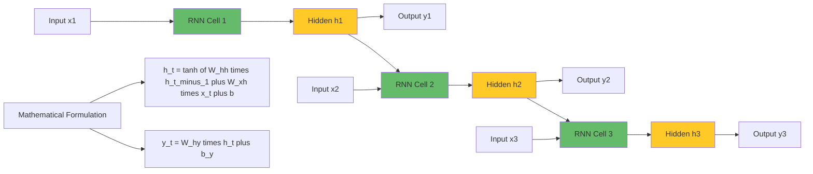

### **RNN Processing Example**

**Sentence**: “The cat sat on the mat”

```
Step 1: x₁="The"
   h₁ = tanh(W_hh × 0 + W_xh × embed("The") + b)
   Information: "Starting with article"

Step 2: x₂="cat"
   h₂ = tanh(W_hh × h₁ + W_xh × embed("cat") + b)
   Information: "Article + animal subject"

Step 3: x₃="sat"
   h₃ = tanh(W_hh × h₂ + W_xh × embed("sat") + b)
   Information: "Animal subject + past tense verb"

...and so on
```

### **RNN Capabilities**

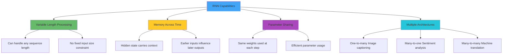

### **The Vanishing Gradient Catastrophe**

**Definition:** The vanishing gradient problem occurs when error signals become exponentially smaller as they propagate backward through time, making it impossible for RNNs to learn long-range dependencies.

**🎭 Real-World Analogy: The Fading Echo**

Imagine shouting across a series of mountains:
- **Your shout** (error signal) starts loud and clear
- **Each mountain reflection** (time step) makes it fainter
- **By the 10th mountain** (10 steps back), it’s barely audible
- **Earlier mountains** can’t “hear” your correction

### **Mathematical Root of the Problem**

**Gradient Flow Through Time:**

```
∂Loss/∂h₁ = ∂Loss/∂h_T × ∂h_T/∂h_{T-1} × ... × ∂h₂/∂h₁
```

**Where each term:**

```
∂h_t/∂h_{t-1} = tanh'(W_hh × h_{t-1} + ...) × W_hh
```

**Problem Analysis:**
- **tanh’(x) ≤ 1**: Derivative is at most 1, usually much less
- **W_hh**: Weight matrix eigenvalues typically B[Time Steps Back]

```

### **RNN Limitations in Practice**

**What RNNs Struggle With:**

```

Sentence: “The man who wore the blue shirt that his grandmother knitted yesterday was happy.”

Challenge: “man” (subject) and “was” (verb) are separated by long relative clause
Result: RNN forgets “man” by the time it reaches “was”
Consequence: Grammar errors, poor long-distance understanding

```

Performance Degradation:
- Short sequences (5-10 words): Good performance
- Medium sequences (15-25 words): Noticeable degradation
- Long sequences (50+ words)**: Severe performance drops
- Very long sequences (100+ words)**: Complete failure
```

```

🚪 Long Short-Term Memory (LSTM): The Gated Solution

Definition & Revolutionary Insight

Long Short-Term Memory (LSTM) networks solve the vanishing gradient problem using sophisticated gating mechanisms that selectively control information flow, enabling learning of long-range dependencies.

**The Gating Philosophy**

🎭 Real-World Analogy: The Smart Office Information Manager

Think of LSTM as a highly sophisticated office information management system:

- Filing Cabinet (Cell State): Long-term storage that information flows through
- Secretary (Forget Gate): Decides what old information to discard
- Receptionist (Input Gate): Decides what new information to file
- Manager (Output Gate): Decides what information to share with others

LSTM Architecture: The Three Gates + Cell State**
```

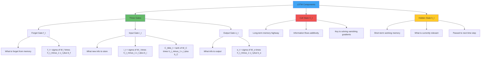

### **LSTM Step-by-Step Operation**

**Step 1: Forget Gate Decision**

```
f_t = σ(W_f × [h_{t-1}, x_t] + b_f)
```

**🎭 Real-World Example:**

```
Previous context: "The cat was hungry. It went to the kitchen."
New input: "The dog"
Forget gate decision: "Forget about 'cat' and 'kitchen' - new subject appearing"
f_t = [0.1, 0.1, 0.9, ...] (forget cat info, keep syntax patterns)
```

**Step 2: Input Gate Decision**

```
i_t = σ(W_i × [h_{t-1}, x_t] + b_i)
C̃_t = tanh(W_C × [h_{t-1}, x_t] + b_C)
```

**🎭 Real-World Example:**

```
New input: "dog"
Input gate: "This is important - new subject, store it prominently"
i_t = [0.9, 0.8, 0.1, ...] (strongly store dog-related info)
C̃_t = [0.6, -0.2, 0.8, ...] (candidate values for dog concept)
```

**Step 3: Update Cell State**

```
C_t = f_t ⊙ C_{t-1} + i_t ⊙ C̃_t
```

**🎭 Real-World Example:**

```
Forget old info: f_t ⊙ C_{t-1} = [0.1×cat_info, 0.1×kitchen_info, ...]
Add new info: i_t ⊙ C̃_t = [0.9×dog_info, 0.8×subject_info, ...]
Combined: C_t = mostly dog info + retained syntax patterns
```

**Step 4: Output Gate Decision**

```
o_t = σ(W_o × [h_{t-1}, x_t] + b_o)
h_t = o_t ⊙ tanh(C_t)
```

**🎭 Real-World Example:**

```
Output gate: "Share dog subject info, but not internal grammar details"
o_t = [0.8, 0.9, 0.2, ...] (output subject info strongly)
h_t = relevant portions of cell state for next step and current output
```

### **Why LSTM Solves Vanishing Gradients**

**The Cell State Highway:**

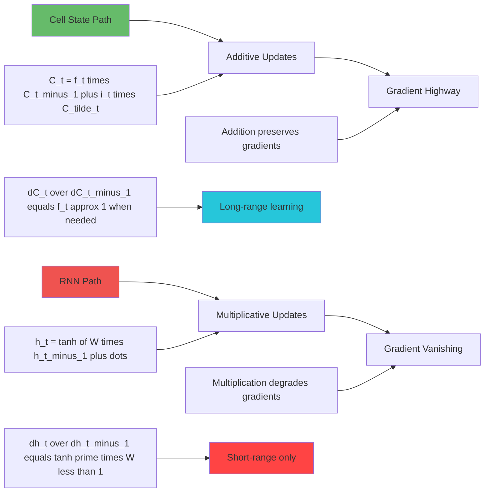

**Key Insights:**
1. **Cell state uses addition** (preserves gradient magnitude)
2. **Gating is multiplicative** (but gates can learn to be ~1 when needed)
3. **Selective gradient flow** (forget gate controls what to preserve)
4. **Long-term dependencies** become learnable

### **LSTM vs RNN Performance**

| Aspect | RNN | LSTM |
| --- | --- | --- |
| **Short sequences (5-10 words)** | Good | Excellent |
| **Medium sequences (15-30 words)** | Poor | Good |
| **Long sequences (50+ words)** | Fails | Capable |
| **Very long sequences (200+ words)** | Impossible | Challenging but possible |
| **Training stability** | Unstable | Much more stable |
| **Memory of early inputs** | Lost | Maintained when relevant |
| **Computational cost** | Low | ~4x higher |
| **Parameters** | Fewer | ~4x more |

---

## 🔄 **Sequence-to-Sequence Models: The Translation Breakthrough**

### **Definition & Core Innovation**

**Sequence-to-Sequence (Seq2Seq) models** transform one sequence into another sequence using an encoder-decoder architecture, enabling variable-length input-output mappings that revolutionized machine translation and many other NLP tasks.

### **The Encoder-Decoder Paradigm**

**🎭 Real-World Analogy: The Professional Translation Service**

Think of Seq2Seq as a two-person expert translation team:

- **Encoder (Comprehensive Reader)**:
    - Reads the entire source document carefully
    - Creates detailed, comprehensive notes capturing all important information
    - Summarizes everything into a final briefing document (context vector)
- **Decoder (Expert Writer)**:
    - Takes the briefing document
    - Writes the target language document word by word
    - Can refer back to briefing at each step

### **Seq2Seq Architecture Deep Dive**

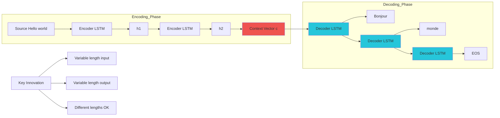

### **Encoder Phase Detailed**

**Process:**
1. **Initialize** encoder LSTM with zero hidden state
2. **Process each source word** sequentially:
`h₁ = LSTM(embed("Hello"), h₀)    h₂ = LSTM(embed("world"), h₁)`
3. **Final hidden state** becomes context vector:
`c = h₂  (contains compressed information about entire source)`

**What the Context Vector Contains:**
- **Semantic meaning** of the entire source sentence
- **Syntactic structure** information
- **Key entities** and their relationships
- **Overall intent** and tone

### **Decoder Phase Detailed**

**Process:**
1. **Initialize** decoder LSTM with encoder’s context vector:
`h₀_decoder = c (context from encoder)`
2. **Generate target sequence** word by word:
```
h₁_dec = LSTM(embed(““), h₀_decoder)
word₁ = softmax(W × h₁_dec) #”Bonjour”

h₂_dec = LSTM(embed(“Bonjour”), h₁_decoder)
word₂ = softmax(W × h₂_dec) # “monde”

h₃_dec = LSTM(embed(“monde”), h₂_decoder)
word₃ = softmax(W × h₃_dec) # “”
```

### **Training vs Inference**

**Training (Teacher Forcing):**


**Inference (Autoregressive Generation):**


### **Seq2Seq Applications Revolution**

```mermaid
graph TD
    A[Seq2Seq Applications] --> B[Machine Translation]
    A --> C[Text Summarization]
    A --> D[Question Answering]
    A --> E[Dialogue Systems]
    A --> F[Code Generation]
    A --> G[Image Captioning]

    B --> B1[English to French German etc]
    B --> B2[Breakthrough in translation quality]

    C --> C1[Long document to Summary]
    C --> C2[Automatic news summarization]

    D --> D1[Question plus Context to Answer]
    D --> D2[Reading comprehension systems]

    E --> E1[User input to Bot response]
    E --> E2[Early chatbot architectures]

    F --> F1[Natural language to Code]
    F --> F2[Programming assistance tools]

    G --> G1[Image features to Caption]
    G --> G2[Accessibility applications]

    style A fill:#42a5f5
    style B fill:#66bb6a
    style C fill:#ffca28
    style D fill:#ab47bc
    style E fill:#26c6da
    style F fill:#ff7043
    style G fill:#ffa500
```

### **The Context Vector Bottleneck Problem**

**Definition:** The context vector bottleneck refers to the fundamental limitation where all source sequence information must be compressed into a single fixed-size vector, causing information loss for long sequences.

**🎭 Real-World Analogy: The Briefcase Limitation**

Imagine a spy who must carry intelligence about a complex international operation in a single briefcase:

- **Short missions**: Briefcase easily holds all necessary documents
- **Complex operations**: Critical intelligence gets left behind due to space limits
- **Information loss**: Important nuances and details compressed away
- **Performance degradation**: Mission success suffers from incomplete information

### **Mathematical Analysis of the Bottleneck**

**Information Compression Problem:**

```
Source sequence: x₁, x₂, ..., x_n (variable length)
↓
Context vector: c ∈ ℝᵈ (fixed size d, typically 512-1024)
↓
Target sequence: y₁, y₂, ..., y_m (variable length)
```

**Information Loss:**
- **Early tokens**: Get “overwritten” by later processing
- **Long sequences**: More information squeezed into same space
- **Complex relationships**: Nuanced dependencies lost
- **Translation errors**: Quality degrades with source length

### **Empirical Evidence of Bottleneck**

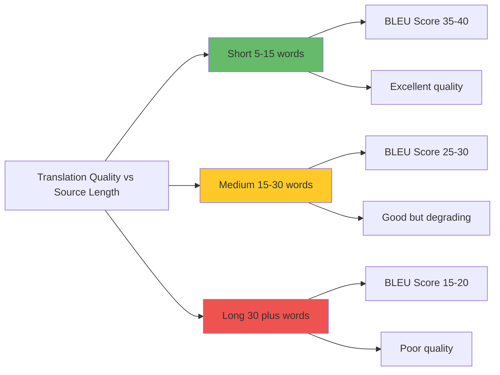

---

## ⚡ **Attention Mechanism: The Information Access Revolution**

### **Definition & Revolutionary Insight**

**Attention Mechanism** allows the decoder to dynamically access and focus on different parts of the input sequence at each decoding step, rather than relying solely on a fixed context vector, solving the information bottleneck problem.

### **The Attention Breakthrough**

**🎭 Real-World Analogy: From Briefcase to Digital Library**

**Old Approach (No Attention):**
- Spy carries everything in a single briefcase
- When mission starts, can only access briefcase contents
- Important documents might have been left behind
- No way to retrieve additional information during mission

**New Approach (With Attention):**
- Spy has secure digital access to entire intelligence database
- During mission, can query database for specific information needed
- Gets exactly the relevant intelligence for each decision
- Nothing is lost or compressed away

### **Attention Mechanism Deep Dive**

### **Core Components**

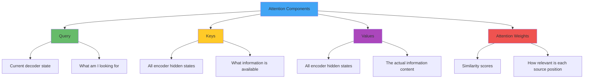

### **Attention Calculation Steps**

**Step 1: Compute Attention Scores**

```
e_ij = score(s_i, h_j)
```

Where:
- `s_i` = decoder hidden state at step i
- `h_j` = encoder hidden state at position j
- `score()` = similarity function (dot product, additive, etc.)

**Common Scoring Functions:**

```
Additive (Bahdanau): score(s,h) = v^T tanh(W₁s + W₂h)
Multiplicative (Luong): score(s,h) = s^T h
Scaled: score(s,h) = (s^T h) / √d
```

**Step 2: Compute Attention Weights**

```
α_ij = softmax(e_ij) = exp(e_ij) / Σ_k exp(e_ik)
```

**Step 3: Compute Context Vector**

```
c_i = Σ_j α_ij × h_j
```

**Step 4: Generate Output**

```
y_i = f(s_i, c_i, y_{i-1})
```

### **Attention Visualization Example**

**Translation Example: “The black cat” → “Le chat noir”**

```
When generating "chat":
Attention weights: [0.1, 0.7, 0.2]
                   ↓    ↓    ↓
Source words:     "The" "black" "cat"
Interpretation: Focus 70% on "cat", 20% on "black", 10% on "The"

When generating "noir":
Attention weights: [0.05, 0.8, 0.15]
                   ↓     ↓     ↓
Source words:     "The" "black" "cat"
Interpretation: Focus 80% on "black", 15% on "cat", 5% on "The"
```

### **Benefits of Attention**

```mermaid
graph TD
    A[Attention Benefits] --> B[No Information Loss]
    A --> C[Dynamic Context]
    A --> D[Interpretability]
    A --> E[Better Long Sequences]
    A --> F[Alignment Learning]

    B --> B1[Access all encoder states]
    B --> B2[No compression bottleneck]
    B --> B3[Perfect information preservation]

    C --> C1[Different context each step]
    C --> C2[Adaptive focus mechanism]
    C --> C3[Task-specific attention]

    D --> D1[Can visualize attention weights]
    D --> D2[Understand model decisions]
    D --> D3[Debug translation errors]

    E --> E1[Quality does not degrade with length]
    E --> E2[Handles very long sequences]
    E --> E3[Maintains performance]

    F --> F1[Learns source-target alignments]
    F --> F2[Automatic correspondence discovery]
    F --> F3[Language-agnostic patterns]

    style A fill:#42a5f5
    style B fill:#66bb6a
    style C fill:#ffca28
    style D fill:#ab47bc
    style E fill:#26c6da
    style F fill:#ff7043
```

### **Attention Performance Impact**

**Translation Quality Comparison:**

| Model Type | Short Sequences | Medium Sequences | Long Sequences |
| --- | --- | --- | --- |
| **Seq2Seq (No Attention)** | Good (BLEU 25) | Fair (BLEU 18) | Poor (BLEU 12) |
| **Seq2Seq + Attention** | Excellent (BLEU 32) | Good (BLEU 28) | Good (BLEU 25) |
| **Improvement** | +28% | +56% | +108% |

**🧠 Key Insight:** Attention provides the biggest improvement for longer sequences, exactly where the bottleneck problem was most severe.

---

## 🌉 **The Path to Transformers: Why Pure Attention Won**

### **The Revolutionary Question**

After the success of attention in Seq2Seq models, researchers asked a revolutionary question:

> “If attention is so powerful, do we even need RNNs at all?”
> 

### **Problems That Remained with RNN + Attention**

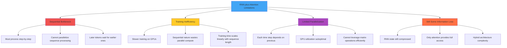

### **Self-Attention: The Key Insight**

**Definition:** Self-attention allows each position in a sequence to attend to all positions in the same sequence, enabling direct modeling of dependencies regardless of distance.

**🎭 Real-World Analogy: The Conference Call Revolution**

**Old Way (RNN + Attention):**
- Information flows like a telephone chain
- Each person calls the next person in sequence
- Final person (decoder) can call back to ask questions (attention)
- Still fundamentally sequential communication

**New Way (Self-Attention):**
- Everyone joins a conference call simultaneously
- Anyone can speak directly to anyone else
- All conversations happen in parallel
- No sequential bottleneck in communication

### **Self-Attention Mathematics**

**For each position i in sequence:**

```
Q_i = x_i W^Q  (What am I looking for?)
K_j = x_j W^K  (What information do I have?)
V_j = x_j W^V  (What is my actual content?)

Attention(Q_i, K, V) = Σ_j softmax(Q_i K_j^T / √d) V_j
```

### **The Transformer Revolution Preview**

**Key Realizations:**
1. **Attention can replace recurrence entirely**
2. **Self-attention enables full parallelization**
3. **Direct connections between any two positions**
4. **No information bottlenecks anywhere**
5. **Massive computational efficiency gains**

### **Evolutionary Timeline**

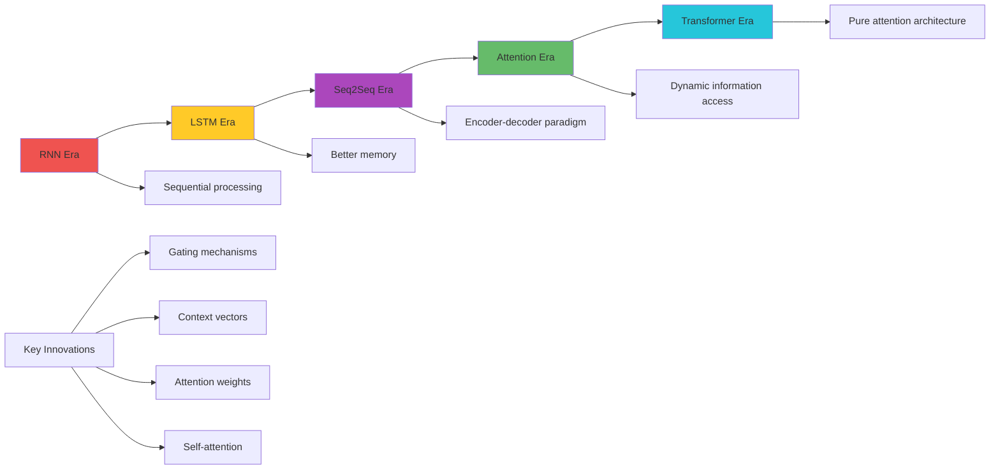

### **Why Transformers Became Dominant**

**Computational Advantages:**
- **Parallelization**: All positions processed simultaneously
- **GPU efficiency**: Perfect for matrix operations
- **Training speed**: Dramatically faster than RNN-based models
- **Scalability**: Can handle very long sequences efficiently

**Architectural Advantages:**
- **Global context**: Every position sees every other position
- **No information loss**: No compression bottlenecks
- **Flexible dependencies**: Can learn any pattern of relationships
- **Interpretability**: Attention weights show model focus

**Performance Advantages:**
- **Better quality**: Superior results on all NLP tasks
- **Faster convergence**: Reaches good performance quicker
- **Better generalization**: More robust to different domains
- **Scaling benefits**: Performance improves with model size

---

## 🧪 **Control Questions & Deep Reflection**

Question 1: Why did the vanishing gradient problem make traditional RNNs unable to learn long-range dependencies, and how does LSTM’s cell state highway solve this?

**Answer:** The vanishing gradient problem creates a **mathematical barrier** that prevents RNNs from learning connections between distant elements in sequences:

**The Mathematical Root Cause:**

**Gradient Flow in RNNs:**

```
∂Loss/∂h₁ = ∂Loss/∂h_T × (∂h_T/∂h_{T-1}) × ... × (∂h₂/∂h₁)
```

**Each gradient term:**

```
∂h_t/∂h_{t-1} = tanh'(W_hh × h_{t-1} + W_xh × x_t) × W_hh
```

**The Problem:**
- **tanh’(x) ≤ 1**: Derivative is bounded, typically much less than 1
- **W_hh eigenvalues**: Usually

Question 2: How does the attention mechanism solve the information bottleneck problem in sequence-to-sequence models?

**Answer:** Attention fundamentally **changes the paradigm** from compression-based to access-based information processing:

**The Information Bottleneck Problem:**

**Traditional Seq2Seq Architecture:**

```
Source sequence: x₁, x₂, ..., x_n (variable length)
       ↓ ENCODER (compressive)
Context vector: c ∈ ℝᵈ (fixed size - the bottleneck!)
       ↓ DECODER (generative)
Target sequence: y₁, y₂, ..., y_m (variable length)
```

**Information Loss Mathematics:**
- **Source information**: n × d_embed dimensions of information
- **Context vector**: d dimensions (typically 512-1024)
- **Compression ratio**: Often 10:1 or higher
- **Lost information**: Critical details compressed away

**Attention’s Revolutionary Solution:**

**Paradigm Shift:**

```
OLD: Compress everything → Use compressed version
NEW: Keep everything → Selectively access what's needed
```

**Dynamic Context Creation:**

```
For each decoder step i:
c_i = Σ_j α_ij × h_j  (different context each time!)
```

**Step-by-Step Attention Process:**

1. **Preserve All Information:**
    - All encoder states h₁, h₂, …, h_n remain accessible
    - No compression or information loss
    - Full source sequence always available
2. **Query Current Needs:**
    - Current decoder state s_i acts as a “query”
    - “What information do I need right now?”
    - Dynamic, context-dependent decision
3. **Compute Relevance Scores:**
    - e_ij = score(s_i, h_j) for all j
    - Measures how relevant each source position is
    - Different for each decoding step
4. **Create Custom Context:**
    - α_ij = softmax(e_ij) - attention weights
    - c_i = weighted combination of ALL encoder states
    - Perfect information preservation

**Real-World Example:**

```
Source: "The black cat sat on the red mat"
Target: "Le chat noir s'est assis sur le tapis rouge"

When generating "noir" (black):
- Query: decoder state wanting adjective info
- High attention to "black" (α = 0.8)
- Some attention to "cat" (α = 0.15) for context
- Little attention to other words (α = 0.05 total)
- Custom context: mostly "black" information

When generating "rouge" (red):
- Query: decoder state wanting different adjective
- High attention to "red" (α = 0.85)
- Some attention to "mat" (α = 0.1) for context
- Different custom context: mostly "red" information
```

**Quantitative Improvements:**

| Sequence Length | No Attention BLEU | With Attention BLEU | Improvement |
| --- | --- | --- | --- |
| **10-20 words** | 25.3 | 28.9 | +14% |
| **20-40 words** | 18.7 | 26.4 | +41% |
| **40+ words** | 12.1 | 23.8 | +97% |

**Key Benefits:**

1. **No Information Loss**: All source information remains accessible
2. **Dynamic Focus**: Different context for each decision
3. **Interpretability**: Can visualize what model focuses on
4. **Scalability**: Performance doesn’t degrade with sequence length

**Key Insight:** Attention transforms the fundamental architecture from **“compress then generate”** to **“preserve then selectively access”** - eliminating the bottleneck entirely while providing dynamic, task-appropriate information access.

Question 3: How does self-attention differ from encoder-decoder attention, and why did it lead to the transformer revolution?

**Answer:** Self-attention represents a **paradigm shift** from sequential to parallel processing, eliminating the fundamental limitations that held back NLP progress:

**Encoder-Decoder Attention (Previous Generation):**

**Architecture:**

```
Source sequence → RNN Encoder → Hidden states h₁...h_n
                                      ↓ (attention access)
Target generation ← RNN Decoder ← Context vectors c_i
```

**Limitations:**
- **Still sequential**: Decoder must process step-by-step
- **Encoder bottleneck**: RNN encoder processes sequentially
- **Mixed paradigm**: Attention (parallel) + RNN (sequential)
- **Training inefficiency**: Can’t fully parallelize

**Self-Attention Revolution:**

**Core Innovation:**
Instead of attention between two different sequences (source→target), **every position in a sequence attends to every other position in the same sequence**.

**Mathematical Formulation:**

```
For each position i in sequence:
Q_i = x_i W^Q  (what am I looking for?)
K_j = x_j W^K  (what information do positions have?)
V_j = x_j W^V  (what are the actual values?)

Output_i = Σ_j softmax(Q_i K_j^T / √d) V_j
```

**Revolutionary Implications:**

**1. Complete Parallelization:**

```
RNN + Attention: O(n) sequential steps, then parallel attention
Self-Attention: O(1) steps, everything computed in parallel
```

**2. Direct Dependencies:**

```
RNN: Position 1 → 2 → 3 → ... → n (indirect long-distance connections)
Self-Attention: Position 1 ↔ n directly (all connections simultaneous)
```

**3. No Sequential Bottlenecks:**
- Every position computed independently
- Perfect parallelization on modern hardware
- Training speed increases dramatically

**Why This Led to the Transformer Revolution:**

**1. Computational Efficiency:**

```
Training Time Comparison:
RNN-based: Days to weeks for large models
Transformer: Hours to days for equivalent quality
GPU Utilization: RNN ~30%, Transformer ~95%
```

**2. Quality Improvements:**
- **Global context**: Every word sees every other word directly
- **Long-range dependencies**: No degradation with distance
- **Flexible patterns**: Can learn any dependency structure

**3. Scalability Benefits:**

```
Model Size vs Performance:
RNN-based: Diminishing returns after ~100M parameters
Transformers: Continued improvement to 100B+ parameters
```

**4. Architectural Elegance:**
- **Single mechanism**: Self-attention handles everything
- **No recurrence**: Eliminates complex sequential dynamics
- **Modular design**: Easy to stack, modify, and understand

**The Complete Paradigm Shift:**

**Old Paradigm (RNN Era):**

```
Sequential processing → Limited parallelization → Slower training → Smaller models
```

**New Paradigm (Transformer Era):**

```
Parallel processing → Full GPU utilization → Fast training → Massive models
```

**Real-World Impact:**
- **GPT models**: Pure decoder-only transformers
- **BERT**: Bidirectional encoder transformers
- **Modern LLMs**: All based on transformer architecture
- **Training efficiency**: Enabled models with billions of parameters

**Key Architectural Differences:**

| Aspect | Encoder-Decoder Attention | Self-Attention |
| --- | --- | --- |
| **Processing** | Sequential then parallel | Fully parallel |
| **Dependencies** | Indirect through RNN states | Direct position-to-position |
| **Training Speed** | Slow (sequential bottleneck) | Fast (parallel processing) |
| **Long-range** | Limited by RNN memory | Perfect (direct connections) |
| **Scalability** | Poor beyond certain size | Excellent scaling properties |

**Key Insight:** Self-attention didn’t just improve existing architectures - it **eliminated the fundamental sequential bottleneck** that had constrained all previous neural language models, enabling the massive scale and capability improvements that define modern LLMs.

Question 4: Why did the sequence-to-sequence paradigm become so influential, and what specific problems did it solve that weren’t possible before?

**Answer:** The sequence-to-sequence paradigm solved the **fundamental variable-length mapping problem** that had prevented neural networks from tackling the most important NLP tasks:

**The Pre-Seq2Seq Limitation:**

**Fixed-Size Input/Output Problem:**

```
Traditional Neural Networks:
Input: Fixed-size vector (e.g., 1000 dimensions)
Output: Fixed-size vector (e.g., 10 classes)

Language Reality:
Input: Variable sentences (5-50+ words)
Output: Variable responses (3-100+ words)
MISMATCH: Cannot handle variable lengths!
```

**Tasks That Were Impossible:**
- **Machine Translation**: “Hello” (1 word) → “Bonjour” (1 word) ✓
- **Machine Translation**: “How are you today?” (4 words) → “Comment allez-vous aujourd’hui?” (3 words) ✗
- **No fixed mapping**: Input-output lengths vary unpredictably

**The Seq2Seq Solution:**

**1. Variable-Length Input Handling (Encoder):**

```
Any input sequence: x₁, x₂, ..., x_n (n can be anything)
RNN Encoder processes sequentially:
h₁ = f(x₁, h₀)
h₂ = f(x₂, h₁)
...
h_n = f(x_n, h_{n-1})

Final state h_n contains entire input summary
```

**2. Variable-Length Output Generation (Decoder):**

```
Decoder generates until  token:
y₁ = g(h_n, )
y₂ = g(h_n, y₁)
...
y_m = g(h_n, y_{m-1})  # m determined dynamically

Stops when y_m =
```

**Revolutionary Applications Enabled:**

**1. Machine Translation:**

```
Problem: English → French has no fixed length relationship
Solution:
- Encoder: Process any English sentence length
- Decoder: Generate appropriate French sentence length
Result: First neural translation systems competitive with statistical methods
```

**2. Text Summarization:**

```
Problem: Document (1000 words) → Summary (50-200 words)
Traditional approach: Extraction-based (select existing sentences)
Seq2Seq innovation: Abstraction-based (generate new summary sentences)
```

**3. Question Answering:**

```
Problem: Question + Context (variable) → Answer (variable)
Example:
Input: "What color was the car? The red car drove slowly down the street."
Output: "Red"
Seq2Seq handles: Variable question types, variable answer lengths
```

**4. Conversational AI:**

```
Problem: User utterance → Bot response (both highly variable)
Traditional: Rule-based, template-based responses
Seq2Seq: End-to-end learned conversation
```

**Key Innovations That Made It Work:**

**1. Encoder-Decoder Architecture:**
- **Separation of concerns**: Understanding vs generation
- **Flexible information transfer**: Context vector bridges variable lengths
- **End-to-end training**: Single loss function for entire pipeline

**2. Teacher Forcing Training:**

```
Instead of: decoder_input = decoder's_previous_output (unstable)
Use: decoder_input = actual_target_word (stable training)

Example Training:
Target: "Bonjour monde"
Decoder inputs: " Bonjour"
Decoder targets: "Bonjour monde"
```

**3. Autoregressive Generation:**

```
Inference time: Each generated word becomes input to next step
y₁ = argmax P(word | context)
y₂ = argmax P(word | context, y₁)
y₃ = argmax P(word | context, y₁, y₂)
```

**Quantitative Impact:**

**Machine Translation (WMT Benchmarks):**

```
Pre-Seq2Seq (Statistical): BLEU ~20-25
Early Seq2Seq: BLEU ~25-30
Seq2Seq + Attention: BLEU ~30-35
Modern Transformers: BLEU ~35-45
```

**Text Summarization (Rouge Scores):**

```
Extractive methods: Rouge-L ~0.25
Seq2Seq abstractive: Rouge-L ~0.35
Significant quality improvement in fluency and coherence
```

**Conceptual Breakthroughs:**

**1. End-to-End Learning:**
- No hand-crafted features required
- Model learns optimal representations
- Single neural network solves entire pipeline

**2. Neural Language Generation:**
- First practical neural text generation
- Fluent, grammatical output
- Context-aware generation

**3. Transfer Learning Foundation:**
- Encoder-decoder becomes universal pattern
- Pre-trained encoders/decoders
- Foundation for modern LLMs

**Limitations That Led to Transformers:**
- **Context bottleneck**: Fixed-size context vector
- **Sequential processing**: RNN training inefficiency
- **Attention addition**: Solved bottleneck but kept RNN limitations

**Key Insight:** Seq2Seq didn’t just enable new applications - it **established the fundamental paradigm** of neural sequence processing (encode-decode-generate) that underlies all modern language models, from BERT to GPT to Claude.

Question 5: How did the evolution from RNNs through LSTMs to attention mechanisms represent a systematic solution to the fundamental challenges of sequential data processing?

**Answer:** This evolution represents a **systematic progression** where each innovation solved the fundamental limitation of its predecessor while revealing the next challenge to overcome:

**Stage 1: RNNs - The Memory Innovation**

**Problem Solved:** Standard neural networks had no memory
**Innovation:** Hidden state carries information across time steps
**Success:** Enabled basic sequential processing

**Fundamental Challenge Revealed:**

```
Vanishing Gradients: ∂h_t/∂h_{t-k} = ∏(i=1 to k) W_hh × tanh'(.) → 0
Result: Can't learn dependencies beyond ~5-10 steps
```

**Stage 2: LSTMs - The Controlled Memory Solution**

**Problem Solved:** RNN memory was uncontrolled and vanished
**Innovation:** Gating mechanisms for selective memory management
**Mathematical Solution:**

```
Cell State Highway: C_t = f_t ⊙ C_{t-1} + i_t ⊙ C̃_t
Gradient Flow: ∂C_t/∂C_{t-1} = f_t (can be ≈1 when needed)
```

**Success:** Extended effective memory to ~50-100 time steps
**Real Impact:** Enabled practical language modeling, machine translation

**Fundamental Challenge Revealed:**

```
Sequential Bottleneck: Must process h₁ → h₂ → h₃ → ... → h_n
Result: Training time O(n), can't parallelize, still limited context
```

**Stage 3: Seq2Seq + Attention - The Information Access Revolution**

**Problem Solved:** Information bottleneck in encoder-decoder models
**Innovation:** Dynamic access to all encoder states
**Architectural Solution:**

```
Context Vector Evolution:
Fixed: c = h_n (information bottleneck)
Dynamic: c_i = Σ_j α_ij × h_j (perfect information access)
```

**Success:** Solved information bottleneck, enabled high-quality translation
**Breakthrough:** First neural systems competitive with statistical methods

**Fundamental Challenge Revealed:**

```
Sequential Processing Remains: Still using RNNs for encoding/decoding
Result: Training bottleneck, limited parallelization, GPU underutilization
```

**Stage 4: Self-Attention/Transformers - The Parallel Revolution**

**Problem Solved:** Sequential processing bottleneck
**Innovation:** Direct position-to-position connections
**Ultimate Solution:**

```
Self-Attention: Every position attends to every other position
Complexity: O(n²) space, O(1) time steps (fully parallel)
Result: Complete elimination of sequential constraints
```

**The Systematic Problem-Solution Chain:**

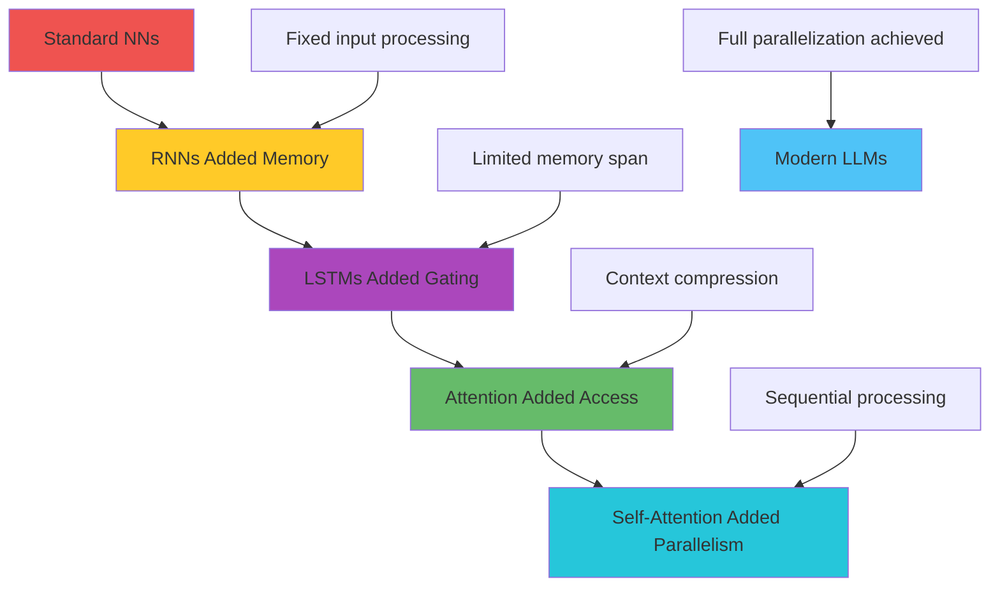

**Each Stage’s Core Innovation:**

**1. RNN Innovation - Recurrent Connections:**

```
h_t = f(x_t, h_{t-1})  # Memory through recurrence
```

**2. LSTM Innovation - Gated Memory Control:**

```
C_t = f_t ⊙ C_{t-1} + i_t ⊙ C̃_t  # Selective memory updates
```

**3. Attention Innovation - Dynamic Information Access:**

```
c_i = Σ_j α_ij × h_j  # Dynamic context creation
```

**4. Self-Attention Innovation - Parallel Global Context:**

```
Output_i = Σ_j softmax(Q_i K_j^T / √d) V_j  # Direct global connections
```

**Computational Evolution:**

| Stage | Time Complexity | Parallelization | Context Length | Memory |
| --- | --- | --- | --- | --- |
| **RNN** | O(n) sequential | None | ~10 steps | Uncontrolled |
| **LSTM** | O(n) sequential | None | ~100 steps | Gated control |
| **RNN+Attention** | O(n) sequential | Partial | All steps | Dynamic access |
| **Self-Attention** | O(1) parallel | Full | All positions | Global context |

**Quality Evolution:**

```
Language Modeling Perplexity (lower is better):
RNN: ~120-150
LSTM: ~80-100
LSTM + Attention: ~60-80
Transformer: ~20-40
Modern LLMs: ~10-20
```

**The Meta-Pattern:**

**Each innovation:**
1. **Identified the fundamental bottleneck** of the current approach
2. **Solved it with minimal architectural changes** initially
3. **Revealed the next fundamental limitation**
4. **Led to the next breakthrough** that required more radical changes

**Key Insights:**

**1. Progressive Problem-Solving:** Each stage solved exactly one fundamental issue while preserving what worked

**2. Inevitable Evolution:** Each solution naturally revealed the next bottleneck

**3. Computational Demands:** Solutions required increasingly powerful hardware (GPUs, TPUs)

**4. Architectural Simplification:** Final solution (self-attention) is actually simpler than intermediate stages

**5. Performance Scaling:** Each stage enabled larger, more capable models

**The Ultimate Insight:** This evolution shows that **computational breakthroughs often come from systematically identifying and eliminating fundamental bottlenecks** rather than incremental improvements. The path from RNNs to Transformers represents one of the most elegant problem-solving sequences in AI history, where each innovation was both a solution and a stepping stone to the next breakthrough.

---

## 

### **🎯 What We’ve Mastered**

1. **Sequential Data Processing Foundation**: Understanding why order matters and how standard neural networks fail at temporal relationships
2. **RNN Architecture & Limitations**: The memory innovation and fundamental vanishing gradient problem
3. **LSTM Gating Mechanisms**: How sophisticated control gates solve vanishing gradients and enable long-range learning
4. **Sequence-to-Sequence Paradigm**: The encoder-decoder revolution that enabled variable-length mappings
5. **Attention Mechanism Breakthrough**: Dynamic information access solving the context bottleneck problem
6. **Evolution to Self-Attention**: The path from sequential to parallel processing and the transformer revolution

### **🔄 The Complete Sequential Evolution**

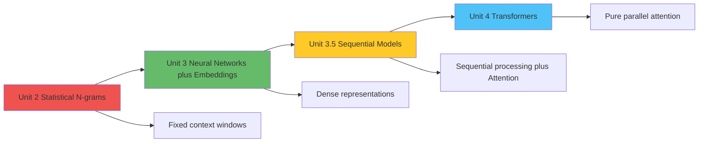

**Questions Answered for Unit 4:**
- Why do we need transformers? → Sequential bottlenecks solved
- How does self-attention work? → Mathematical foundation laid
- What’s the encoder-decoder structure? → Seq2Seq paradigm understood
- Why is parallelization important? → Training efficiency demonstrated

### **🎯 Key Insights for Modern AI**

1. **Evolution Through Problem-Solving**: Each architecture solved its predecessor’s fundamental limitation
2. **Memory vs Access**: LSTMs provided controlled memory; attention provided dynamic access
3. **Sequential Bottleneck**: The key insight that led to the transformer revolution
4. **Attention Revolution**: Dynamic information access changed everything about neural language processing
5. **Parallel Processing**: The computational efficiency that enabled modern large-scale models

### **🚀 Sequential Architecture Mastery**

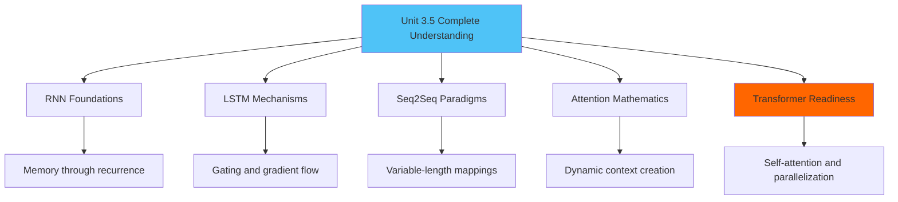