# Neural Language Modeling

## 🎯 **Learning Objectives**

By the end of this unit, you’ll master:
- **How neural networks revolutionized language modeling** beyond statistical n-grams
- **Word embeddings** as the foundation for neural text processing and semantic understanding
- **The complete architecture of neural networks** from single neurons to complex MLPs
- **Training dynamics** including backpropagation, loss functions, and optimization strategies
- **Advanced activation functions** including softmax and modern variants used in LLMs
- **Regularization techniques** that prevent overfitting and improve generalization
- **The bias-variance tradeoff** and how it affects model performance in language tasks

---

## 🎬 **The Neural Revolution in Language Modeling**

### **Definition & Paradigm Shift**

**Neural Language Modeling** refers to the use of artificial neural networks to learn probability distributions over sequences of words, replacing traditional statistical methods with learned representations and non-linear transformations.

**🎭 Real-World Analogy: From Calculator to Brain**

Imagine the evolution from a pocket calculator (n-grams) to a human brain (neural networks):

- **Calculator (N-grams)**: Fast, precise, but can only handle predefined operations with fixed lookup tables
- **Brain (Neural Networks)**: Slower to train initially, but can learn complex patterns, generalize to new situations, and discover hidden relationships

### **The Fundamental Transformation**


**🧠 Key Insight:** Neural networks don’t just predict the next word - they learn rich, distributed representations that capture semantic relationships, syntactic patterns, and contextual nuances that statistical models miss.

---

## 📊 **Neural Text Representation: Word Embeddings**

### **Definition & The Input Problem**

**Word Embeddings** are dense, low-dimensional vector representations of words that capture semantic and syntactic relationships by mapping words from a discrete vocabulary space to a continuous vector space where similar words are located close to each other.

### **The Fundamental Challenge**

**🎭 Real-World Analogy: From Library Card Catalogs to Google Search**

Imagine the transformation of how we organize and search for information:

- **Old Library (One-hot encoding)**: Each book has a single catalog card in one specific drawer. Books are completely separate entities with no relationships.
- **Modern Search Engine (Word embeddings)**: Every piece of content exists in a multidimensional semantic space where related concepts cluster together and relationships emerge naturally.

This is exactly what happened when NLP moved from discrete word representations to dense embeddings!

### **From Sparse to Dense: The Representation Revolution**


### **Problems with One-Hot Encoding**

| Issue | One-Hot Problem | Embedding Solution |
| --- | --- | --- |
| **Sparsity** | 99.9% zeros, 0.1% ones | Dense, meaningful values |
| **Size** | Vocabulary size (50K+ dims) | Fixed size (50-300 dims) |
| **Relationships** | All words equally distant | Similar words close together |
| **Storage** | Massive memory waste | Efficient representation |
| **Similarity** | No semantic understanding | Cosine similarity captures meaning |

### **The Distributional Hypothesis Foundation**

**Definition:** The Distributional Hypothesis states that words that occur in similar contexts tend to have similar meanings - “You shall know a word by the company it keeps” (J.R. Firth, 1957).

**🎭 Real-World Analogy: The Social Circle Theory**

Think of words like people at a large social gathering:
- **People who hang out together** usually have similar interests, backgrounds, or personalities
- **If you see someone constantly with musicians**, they’re likely musical too
- **Word contexts** are like social circles - words appearing in similar contexts tend to have similar meanings

---

## 🎯 **Word2Vec: Learning Word Relationships**

### **Definition & Architecture**

**Word2Vec** is a group of related models that learn word embeddings by training a shallow neural network to predict words from their context (Skip-gram) or predict context from words (CBOW - Continuous Bag of Words).

### **Two Flavors of Word2Vec**

```mermaid
graph TD
    A[Word2Vec Architectures] --> B[CBOW]
    A --> C[Skip-gram]

    B --> B1[Continuous Bag of Words]
    B --> B2[Context → Target word]
    B --> B3[Predict center word from surrounding]
    B --> B4[Faster training]

    C --> C1[Skip-gram with Negative Sampling]
    C --> C2[Target word → Context]
    C --> C3[Predict surrounding from center]
    C --> C4[Better for rare words]

    D[Example] --> E[The quick brown fox jumps]
    E --> F[CBOW: the, quick, brown, jumps → fox]
    E --> G[Skip-gram: fox → the, quick, brown, jumps]

    style A fill:#42a5f5
    style B fill:#66bb6a
    style C fill:#ffca28
    style D fill:#ab47bc
```



### **CBOW (Continuous Bag of Words)**

**Definition:** CBOW predicts a target word based on its surrounding context words, treating the context as an unordered bag of words.

**🎭 Real-World Analogy: The Context Detective**

Imagine you’re a detective trying to guess a missing word from a sentence by looking at all the surrounding clues:

```
"The quick brown ___ jumps over the lazy dog"
```

You examine: [“The”, “quick”, “brown”, “jumps”, “over”, “lazy”, “dog”] and deduce the missing word is probably “fox” or “cat”.

**CBOW Architecture:**


### **Skip-gram Model**

**Definition:** Skip-gram predicts surrounding context words given a target word, maximizing the probability of context words appearing near the target word.

**🎭 Real-World Analogy: The Word Association Game**

Given a word like “fox”, what other words are likely to appear nearby? A good model should predict: “quick”, “brown”, “jumps”, “forest”, “clever”, etc.

**Skip-gram Architecture:**


### **Training Objectives**

**CBOW Objective:**

```
Maximize: P(target_word | context_words)
```

**Skip-gram Objective:**

```
Maximize: P(context_words | target_word)
```

### **Negative Sampling: Making Training Efficient**

**Definition:** Negative sampling is a training technique that approximates the computationally expensive softmax by randomly sampling negative examples, making Word2Vec training feasible for large vocabularies.

**🎭 Real-World Analogy: The Efficient Exam System**

Instead of testing a student on every possible question (expensive), give them a few positive examples and a few random negative examples. They learn to distinguish good answers from bad ones efficiently.

**How Negative Sampling Works:**
1. For each positive word pair (target, context)
2. Sample k random “negative” words that don’t appear in context
3. Train the model to give high scores to positive pairs and low scores to negative pairs

---

## 🌐 **GloVe: Global Vectors for Word Representation**

### **Definition & Core Insight**

**GloVe (Global Vectors)** combines the advantages of global matrix factorization methods with local context window methods by training on aggregated global word co-occurrence statistics from a corpus.

### **The Key Insight: Global + Local**

**🎭 Real-World Analogy: The Census vs. Survey Approach**

- **Word2Vec (Local)**: Like conducting individual surveys - looks at local neighborhoods around each word
- **GloVe (Global)**: Like conducting a national census - examines global co-occurrence patterns across the entire corpus

**GloVe Philosophy:**
> “Ratios of co-occurrence probabilities can encode meaning components”

### **Co-occurrence Matrix Foundation**


### **The Magic of Probability Ratios**

**Example: Understanding “ice” vs “steam”**

| Word k | P(k|ice) | P(k|steam) | Ratio P(k|ice)/P(k|steam) |
| --- | --- | --- | --- |
| solid | 0.00019 | 0.000022 | 8.9 |
| gas | 0.000066 | 0.00078 | 0.085 |
| water | 0.0011 | 0.0022 | 0.49 |
| fashion | 0.000017 | 0.000018 | 0.96 |

**🧠 Key Insight:** The ratio reveals semantic relationships better than individual probabilities!

### **GloVe vs Word2Vec Comparison**


| Aspect | Word2Vec | GloVe |
| --- | --- | --- |
| **Training Data** | Local context windows | Global co-occurrence matrix |
| **Training Style** | Online/streaming | Batch processing |
| **Approach** | Predictive | Count-based + predictive |
| **Efficiency** | Good for large corpora | Better for smaller corpora |
| **Analogies** | Good | Excellent |
| **Rare Words** | Better handling | Challenges with rare words |

---

## 📐 **Embedding Space Properties: The Semantic Geometry**

### **Vector Arithmetic Magic**

**Definition:** Embedding space properties refer to the geometric relationships in vector space that capture semantic and syntactic regularities, enabling arithmetic operations on word meanings.

**🎭 Real-World Analogy: The GPS Coordinate System**

Just as GPS coordinates capture geographic relationships where you can compute “Tokyo - Japan + France = Paris”, word embeddings capture semantic relationships in vector space.

### **Famous Examples of Vector Arithmetic**


### **Geometric Relationships**

**Cosine Similarity:**

```
similarity = cos(θ) = (A · B) / (||A|| × ||B||)
```

**Distance Relationships:**
- **Close vectors**: Semantically similar words
- **Parallel vectors**: Analogical relationships
- **Perpendicular vectors**: Unrelated concepts

### **Visualization of Embedding Space**

**🎭 Real-World Analogy: The Semantic Map**

Think of word embeddings as creating a multidimensional map where:
- **Cities (words)** cluster by similarity
- **Countries (semantic fields)** group related concepts
- **Directions (vector differences)** capture relationships


---

## ⚡ **Neural Networks: The Building Blocks**

### **Definition & Biological Inspiration**

**Artificial Neural Networks** are computational models inspired by biological neural networks, consisting of interconnected processing units (neurons) that transform inputs through weighted connections and non-linear activation functions.

**🎭 Real-World Analogy: The Neuron Committee**

Think of a biological neuron as a committee member in a large organization who:
1. **Receives inputs** from other committee members (dendrites)
2. **Weighs the importance** of each input based on trust/relevance (synaptic weights)
3. **Makes a decision** whether to pass the message along (activation threshold)
4. **Sends the output** to other committee members (axon)

### **Mathematical Model of a Neuron**


**Mathematical Formulation:**

```
Output = φ(w₁x₁ + w₂x₂ + w₃x₃ + b)
```

**Where:**
- **xᵢ**: Input features (word embeddings, previous layer outputs)
- **wᵢ**: Learned weights (importance of each input)
- **b**: Bias term (baseline activation level)
- **φ**: Activation function (introduces non-linearity)

### **From Single Neuron to Network**

**🎭 Real-World Analogy: From Solo Artist to Orchestra**

A single neuron is like a talented solo musician - capable but limited. A neural network is like a full symphony orchestra where:
- **Different sections** (layers) handle different aspects of the music
- **Individual musicians** (neurons) contribute their specialized part
- **The conductor** (training algorithm) coordinates everyone
- **The final performance** (output) emerges from collective intelligence

---

## 🏗️ **Multi-Layer Perceptron (MLP) Architecture**

### **Definition & Structure**

**Multi-Layer Perceptron (MLP)** is a feedforward neural network consisting of multiple layers of neurons, where each layer is fully connected to the next layer, enabling the learning of complex non-linear mappings.

### **Layer-by-Layer Understanding**


### **The Data Transformation Journey**

**🎭 Real-World Analogy: The Art Restoration Process**

Think of each layer as a step in professional art restoration:

1. **Input Layer**: Raw word embeddings (semantic vectors from our embedding space)
2. **Hidden Layer 1**: Initial pattern detection (basic feature extraction - syntactic patterns, simple relationships)
3. **Hidden Layer 2**: Complex pattern recognition (advanced linguistic features, contextual understanding)
4. **Output Layer**: Final language decision (next word probability distribution)

**🧠 Key Insight:** Each layer **stretches and squishes** the embedding space, transforming word vectors into increasingly abstract representations suitable for language modeling.

### **How Networks Learn Language Representations**

**Definition:** **Representation Learning** is the ability of neural networks to automatically discover and learn useful linguistic features from raw word embeddings without manual feature engineering.

| Layer Level | Language Example | Input | Abstraction Level |
| --- | --- | --- | --- |
| **Input** | Word embeddings | [0.2, -0.1, 0.8, …] | Semantic vectors |
| **Layer 1** | Syntactic patterns | Noun-verb relationships | Low-level linguistics |
| **Layer 2** | Grammatical structures | Subject-predicate patterns | Mid-level patterns |
| **Layer 3** | Contextual meaning | Discourse-level understanding | High-level concepts |
| **Output** | Next word prediction | Probability distribution | Task-specific |

---

## 🔥 **Activation Functions: The Non-Linear Engines**

### **Definition & Necessity**

**Activation Functions** are non-linear functions applied to the output of each neuron, enabling neural networks to learn complex, non-linear relationships in data and preventing the collapse of deep networks into simple linear transformations.

### **Why Non-Linearity is Crucial**

**🎭 Real-World Analogy: The Decision-Making Process**

Without activation functions, neural networks would be like a person who can only think in straight lines:
- **Linear thinking**: “If A increases by 1, B increases by exactly 2”
- **Non-linear thinking**: “If A increases by 1, B might increase by 3, unless C is present, in which case B decreases”

**Mathematical Reality:** Without non-linearity, a 100-layer network would collapse to a single linear transformation - no matter how deep!

### **Comprehensive Activation Function Landscape**


### **Classical Era Functions**

### **1. Sigmoid Function**

```
σ(x) = 1 / (1 + e^(-x))
```

**🎭 Real-World Analogy: The Smooth Switch**
Like a dimmer switch that smoothly transitions from off to on, sigmoid provides smooth transitions between 0 and 1.

**Properties:**
- **Range**: (0, 1)
- **Smooth**: Differentiable everywhere
- **Saturates**: Outputs approach 0 or 1 for extreme inputs
- **Problem**: Vanishing gradient for deep networks

### **2. Hyperbolic Tangent (Tanh)**

```
tanh(x) = (e^x - e^(-x)) / (e^x + e^(-x))
```

**Properties:**
- **Range**: (-1, 1)
- **Zero-centered**: Unlike sigmoid, outputs can be negative
- **Still suffers**: Vanishing gradient problem
- **Better than sigmoid**: For hidden layers due to zero-centering

### **3. Binary Step Function**

```
f(x) = {1 if x ≥ 0, 0 if x  0, αx if x ≤ 0} where α = 0.01
```

**Solution to dead neurons**: Allows small negative values to pass through

### **6. Parametric ReLU (PReLU)**

```
PReLU(x) = {x if x > 0, αx if x ≤ 0} where α is learnable
```

**Adaptive approach**: The negative slope α is learned during training

### **7. Exponential Linear Unit (ELU)**

```
ELU(x) = {x if x > 0, α(e^x - 1) if x ≤ 0}
```

**Benefits**: Smooth, reduces bias shift, can output negative values

### **8. Mish (Modern Alternative)**

```
Mish(x) = x × tanh(softplus(x)) = x × tanh(ln(1 + e^x))
```

**Properties**: Smooth, non-monotonic, self-regularizing
**Performance**: Often outperforms ReLU and Swish in practice

### **LLM-Specific Functions (Critical for Language Models)**

### **9. Softmax (MOST CRITICAL for LLMs)**

```
Softmax(x_i) = e^(x_i) / Σ(j=1 to n) e^(x_j)
```

**🎭 Real-World Analogy: The Democratic Voting System**

Think of softmax like converting raw vote counts into percentages:
- Raw votes:
- Softmax percentages: [42.9%, 28.6%, 17.9%, 10.7%]
- All percentages sum to exactly 100%

**Why ESSENTIAL for LLMs:**
- **Output layer**: Converts neural network logits to word probabilities
- **Next token prediction**: Enables probabilistic text generation
- **Probability distribution**: Ensures all outputs sum to 1

**Temperature Scaling in LLMs:**

```
Softmax(x_i / τ) where τ is temperature
- τ  1: More uncertain, flatter distribution (more random)
- τ = 1: Standard softmax
```

**Example:**

```
Logits: [2.0, 1.0, 0.1]
τ = 0.5 (confident): [0.84, 0.14, 0.02] - mostly first choice
τ = 1.0 (normal): [0.66, 0.24, 0.10] - balanced
τ = 2.0 (creative): [0.42, 0.35, 0.23] - more diverse
```

### **10. GELU (Gaussian Error Linear Unit)**

```
GELU(x) = x × Φ(x) = x × P(X ≤ x) where X ~ N(0,1)
```

**🎭 Real-World Analogy: The Probability Gate**
Instead of hard cutoffs like ReLU, GELU uses probability - inputs are gated by their likelihood under a normal distribution.

**Why popular in Transformers:**
- **Smooth**: No sharp corners like ReLU
- **Probabilistic**: Based on statistical principles
- **Performance**: Works well in large language models

### **11. Swish**

```
Swish(x) = x × σ(βx) = x × (1 / (1 + e^(-βx)))
```

**Self-gating mechanism**: The function gates itself using its sigmoid

### **12. SwiGLU (Used in modern LLMs)**

```
SwiGLU(x) = Swish(W₁x + b₁) ⊙ (W₂x + b₂)
```

where ⊙ is element-wise multiplication

**Advanced gating**: Used in GPT, PaLM, and other state-of-the-art models

### **13. Softplus**

```
Softplus(x) = ln(1 + e^x)
```

**Properties**: Smooth approximation of ReLU, always positive

### **Activation Function Comparison Table**

| Function | Formula | Range | Pros | Cons | LLM Usage |
| --- | --- | --- | --- | --- | --- |
| **Sigmoid** | `1/(1+e^-x)` | `(0,1)` | Smooth, interpretable | Vanishing gradients | Rarely in hidden layers |
| **Tanh** | `(e^x-e^-x)/(e^x+e^-x)` | `(-1,1)` | Zero-centered | Vanishing gradients | Rarely in hidden layers |
| **ReLU** | `max(0,x)` | `[0,∞)` | Fast, solves vanishing | Dead neurons | Common in hidden layers |
| **Leaky ReLU** | `max(0.01x,x)` | `(-∞,∞)` | No dead neurons | Fixed slope | Some hidden layers |
| **GELU** | `x·Φ(x)` | `(-0.17,∞)` | Smooth, probabilistic | Computational cost | **Transformer standard** |
| **Swish** | `x·σ(βx)` | `(-∞,∞)` | Self-gating | Complex | Some LLMs |
| **Softmax** | `e^xi/Σe^xj` | `(0,1)` | Probability distribution | Can saturate | **Essential output layer** |
| **SwiGLU** | Complex gating | Variable | SOTA performance | Very complex | **Modern LLMs** |
| **Mish** | `x·tanh(softplus(x))` | `(-0.31,∞)` | Smooth, self-regularizing | Computational cost | Research models |

### **Choosing the Right Activation Function**


---

## 📉 **Loss Functions: Teaching Networks What’s Wrong**

### **Definition & Purpose**

**Loss Functions** are mathematical functions that quantify the difference between predicted outputs and actual target values, providing the error signal that guides the learning process.

**🎭 Real-World Analogy: The Perfectionist Teacher**

Think of loss functions as different types of teachers with different philosophies:

- **Cross-Entropy Teacher**: The literature teacher who cares deeply about confidence in essay answers
- **Mean Squared Error Teacher**: The math teacher who heavily penalizes big mistakes
- **Mean Absolute Error Teacher**: The practical teacher who treats all mistakes equally

### **Loss Functions for Different Tasks**


### **1. Cross-Entropy Loss (Critical for Language Modeling)**

**Definition:** Cross-entropy loss measures the difference between predicted probability distributions and true distributions, heavily penalizing confident incorrect predictions.

**Formula:**

```
CE_loss = -Σ y_true * log(y_predicted)
```

**For language modeling:**

```
CE_loss = -log(P(actual_next_word))
```

**Why Perfect for Language Modeling:**
- **Probability distributions**: Next word prediction is inherently probabilistic
- **Confidence penalty**: Wrong confident predictions hurt more than uncertain ones
- **Direct connection**: Related to perplexity (our evaluation metric from Unit 2!)

**🎭 Real-World Analogy: The Confident Wrong Answer**
A student who confidently gives the wrong answer (high probability on wrong word) gets penalized much more than a student who uncertainly gives the wrong answer.

### **2. KL Divergence (Advanced Language Modeling)**

**Definition:** Kullback-Leibler divergence measures how one probability distribution differs from another.

**Formula:**

```
KL(P||Q) = Σ P(i) * log(P(i)/Q(i))
```

**🎭 Real-World Analogy: The Cultural Distance Meter**
Like measuring how different two cultures are by comparing their customs, values, and behaviors.

---

## 🎯 **Training Neural Networks**

### **The Learning Process Overview**

**Definition:** **Neural Network Training** is the iterative process of adjusting network parameters (weights and biases) to minimize the loss function using gradient-based optimization.

**🎭 Real-World Analogy: Learning to Play Piano**

Training a neural network is remarkably similar to learning piano:

1. **Initialization**: Start with random finger positions (random weights)
2. **Forward Pass**: Play a piece (make predictions)
3. **Calculate Error**: Listen to how wrong it sounds (compute loss)
4. **Backward Pass**: Figure out which fingers to adjust (backpropagation)
5. **Update**: Move fingers slightly in the right direction (gradient descent)
6. **Repeat**: Practice until you can play beautifully (convergence)

### **Forward Propagation in Detail**

**Definition:** Forward propagation is the process of passing input data through the network layers to generate predictions.


### **Backpropagation: The Chain Rule in Action**

**Definition:** Backpropagation computes gradients of the loss function with respect to each parameter by applying the chain rule backwards through the network.

**🎭 Real-World Analogy: Tracing the Mistake**

Imagine you made an error in a complex financial calculation that went through multiple departments. To fix it, you need to trace back through each step to see which operation in which department contributed how much to the final mistake.

**Chain Rule Application:**

```
∂Loss/∂w₁ = ∂Loss/∂output × ∂output/∂h₂ × ∂h₂/∂h₁ × ∂h₁/∂w₁
```

**Backpropagation Algorithm Steps:**

```mermaid
graph TD
    A[Backpropagation Process] --> B[Forward Pass]
    A --> C[Compute Loss]
    A --> D[Backward Pass]
    A --> E[Update Parameters]

    B --> B1[Embeddings → Hidden → Output → Softmax]
    B --> B2[Store intermediate values]

    C --> C1[Compare prediction vs actual word]
    C --> C2[Calculate cross-entropy loss]

    D --> D1[Output → Hidden → Embeddings]
    D --> D2[Chain rule at each layer]
    D --> D3[Compute all gradients]

    E --> E1[weights = weights - lr × gradients]
    E --> E2[biases = biases - lr × gradients]
    E --> E3[Ready for next batch]

    style A fill:#4fc3f7
    style B fill:#66bb6a
    style C fill:#ffca28
    style D fill:#ab47bc
    style E fill:#26c6da
```



### **Gradient Descent Variants**

**Definition:** Gradient Descent is an optimization algorithm that iteratively adjusts parameters in the direction of steepest descent of the loss function.


### **Learning Rate: The Step Size Dilemma**

**Definition:** Learning Rate controls how much to adjust parameters with respect to the loss gradient at each step.

**🎭 Real-World Analogy: The Mountain Hiker’s Dilemma**

```mermaid
graph TD
    A[Learning Rate Effects] --> B[Too Low]
    A --> C[Just Right]
    A --> D[Too High]

    B --> B1[🐌 Very slow progress]
    B --> B2[May get stuck on plateaus]
    B --> B3[Safe but inefficient]

    C --> C1[⚡ Optimal progress]
    C --> C2[Reaches minimum efficiently]
    C --> C3[Balanced exploration]

    D --> D1[🦘 Jumping around wildly]
    D --> D2[May overshoot minimum]
    D --> D3[Can diverge completely]

    style B fill:#ffca28
    style C fill:#66bb6a
    style D fill:#ff4444
```



### **Advanced Optimizers for Modern LLMs**

### **Adam Optimizer**

**Formula:**

```
m_t = β₁m_{t-1} + (1-β₁)g_t
v_t = β₂v_{t-1} + (1-β₂)g_t²
θ_{t+1} = θ_t - α * m̂_t / (√v̂_t + ε)
```

**Key features:**
- **Adaptive**: Different learning rates for different parameters
- **Momentum**: Uses moving averages of gradients
- **Popular**: Widely used in training LLMs

### **AdamW (Adam with Weight Decay)**

- **Improvement**: Better weight decay handling
- **Used in**: GPT, BERT, and most modern LLMs
- **Better generalization**: Prevents overfitting better than standard Adam

---

## 🛡️ **Regularization: Preventing Overfitting**

### **Definition & The Overfitting Problem**

**Regularization** techniques prevent overfitting by adding constraints or penalties to the model, encouraging simpler solutions that generalize better to unseen data.

**🎭 Real-World Analogy: The Over-Studious Student**

Imagine a student who memorizes every single practice problem perfectly, including typos and irrelevant details, but fails the actual exam because they never learned to generalize.

### **Regularization Techniques Arsenal**


### **Dropout: Random Neuron Vacation**

**Definition:** Dropout randomly sets a fraction of neurons to zero during training, forcing the network to not rely too heavily on specific features.

**🎭 Real-World Analogy: Cross-Training Athletes**

Think of dropout like forcing basketball players to sometimes play with blindfolds or one hand tied. This makes the team not over-rely on any single player’s skills.

### **Layer Normalization (Critical for LLMs)**

**Definition:** Layer normalization normalizes inputs across the feature dimension for each individual sample, making training more stable.

**Formula:**

```
LayerNorm(x) = γ * (x - μ) / σ + β
where μ = mean(x), σ = std(x)
```

**Why Essential for LLMs:**
- **Training stability**: Prevents internal covariate shift
- **Faster convergence**: Allows higher learning rates
- **Better generalization**: Acts as regularization
- **Batch independence**: Works regardless of batch size

---

## ⚖️ **The Bias-Variance Tradeoff**

### **Definition & Core Concept**

**Bias-Variance Tradeoff** describes the relationship between model complexity, underfitting (high bias), and overfitting (high variance).

### **Understanding the Fundamental Tradeoff**

**🎭 Real-World Analogy: The Archery Competition**

```mermaid
graph TD
    A[Model Performance Types] --> B[Low Bias, Low Variance]
    A --> C[Low Bias, High Variance]
    A --> D[High Bias, Low Variance]
    A --> E[High Bias, High Variance]

    B --> B1[🎯 Accurate & Consistent]
    B --> B2[Perfect model - our goal]
    B --> B3[Hits bullseye consistently]

    C --> C1[🎯 Accurate but Inconsistent]
    C --> C2[Overfitting scenario]
    C --> C3[On target on average, scattered]

    D --> D1[🎯 Consistent but Inaccurate]
    D --> D2[Underfitting scenario]
    D --> D3[Consistently off-target]

    E --> E1[🎯 Inaccurate & Inconsistent]
    E --> E2[Worst case scenario]
    E --> E3[Random, poor performance]

    style B fill:#66bb6a
    style C fill:#ffca28
    style D fill:#ffca28
    style E fill:#ff4444
```



### **The Double Descent Phenomenon**

**Definition:** Double descent is the counterintuitive observation that test error can decrease again after initially increasing with model complexity.

```mermaid
graph LR
    A[Model Complexity Journey] --> B[Underparameterized]
    A --> C[Classical Overfitting]
    A --> D[Overparameterized]

    B --> B1[High bias dominates]
    B --> B2[Insufficient model capacity]
    B --> B3[Underfitting]

    C --> C1[High variance dominates]
    C --> C2[Model memorizes training data]
    C --> C3[Traditional overfitting]

    D --> D1[Interpolation + implicit regularization]
    D --> D2[Model finds simpler solutions]
    D --> D3[Surprising generalization]

    style B fill:#ff4444
    style C fill:#ffca28
    style D fill:#66bb6a
```

**Modern LLM Implications:**
- **Scaling Laws**: Bigger models often generalize better
- **Overparameterization Benefits**: More parameters can improve generalization
- **Training Philosophy**: Don’t fear large model sizes

---

## 🧪 **Control Questions & Deep Reflection**

<details>
<summary><strong>Question 1:</strong> How do word embeddings solve the fundamental problem of representing discrete text in continuous neural networks?</summary>

**Answer:** Word embeddings solve the **discrete-continuous gap** that is fundamental to neural language processing, enabling the mathematical operations that neural networks require:

**The Fundamental Problem:**

- **Neural networks operate on continuous vectors** (real-valued numbers that can be added, multiplied, differentiated)
- **Language consists of discrete symbols** (words are categorical, not numerical)
- **No inherent similarity**: "cat" and "dog" are equally distant in discrete space
- **Computational impossibility**: Can't perform gradient descent on discrete symbols

**Word Embeddings Solutions:**

**1. Dense Continuous Representation:**

- One-hot encoding: `cat = [0,0,1,0,0...0]` - sparse, no relationships
- Word embeddings: `cat = [0.2, -0.1, 0.8, 0.3, ...]` - dense, meaningful values
- Mathematical operations: Can compute distances, similarities, gradients

**2. Semantic Relationships Encoded:**

- Cosine similarity: `similarity(cat, dog) = 0.85` (high)
- Vector arithmetic: `king - man + woman ≈ queen`
- Cluster structure: Related words cluster together in embedding space

**3. Learning-Friendly Properties:**

- Differentiable: Can compute gradients with respect to embedding parameters
- Fixed dimensionality: All words map to same vector size (e.g., 300D)
- Composable: Can be input to any neural architecture

**The Bridge Process:**

`Discrete Tokens → Embedding Lookup → Continuous Vectors → Neural Processing
"cat"          → embedding_matrix[cat_id] → [0.2,-0.1,0.8,...]  → MLP/RNN/Transformer`

**Key Insight:** Word embeddings are the **universal translator** between the discrete world of human language and the continuous world of neural computation, enabling all modern NLP to exist.

</details>
<details>
<summary><strong>Question 2:</strong> Why is softmax so critical for language models, and how does temperature scaling affect text generation?</summary>

**Answer:** Softmax is **the essential bridge** between neural network outputs and probabilistic text generation, making it the most critical activation function for language models:

**Why Softmax is Essential:**

**1. Probability Distribution Creation:**

- Converts raw logits to valid probabilities that sum to 1
- Enables probabilistic sampling for text generation
- Provides confidence measures for each word choice

**2. Mathematical Foundation:**

`P(word_i) = e^(logit_i) / Σ(j=1 to V) e^(logit_j)`

- Exponential function emphasizes differences in logits
- Normalization ensures valid probability distribution
- Differentiable for backpropagation training

**3. Training Compatibility:**

- Works seamlessly with cross-entropy loss
- Enables maximum likelihood training
- Provides clear gradient signals for learning

**Temperature Scaling Magic:**

**Formula:** `Softmax(logits/τ)` where τ is temperature

**Effect on Generation:**

- **τ < 1 (Cold)**: More confident, deterministic
    
    `Logits: [2.0, 1.0, 0.1]
    τ=0.5: [0.84, 0.14, 0.02] → Predictable text`
    
- **τ = 1 (Normal)**: Balanced randomness
    
    `τ=1.0: [0.66, 0.24, 0.10] → Natural text`
    
- **τ > 1 (Hot)**: More random, creative
    
    `τ=2.0: [0.42, 0.35, 0.23] → Creative, diverse text`
    

**Real-World Applications:**

- **Creative writing**: Higher temperature for diversity
- **Code generation**: Lower temperature for accuracy
- **Factual responses**: Very low temperature for consistency

**Key Insight:** Softmax doesn't just predict the next word - it creates a **probability landscape** that can be shaped by temperature to control the creativity-accuracy tradeoff in language generation.

</details>
<details>
<summary><strong>Question 3:</strong> How does the distributional hypothesis enable both Word2Vec and GloVe to learn semantic relationships despite their different approaches?</summary>

**Answer:** The distributional hypothesis provides the **theoretical foundation** that makes both Word2Vec and GloVe work, despite their different implementation strategies:

**The Fundamental Principle:**

*"Words that occur in similar contexts tend to have similar meanings"* - This transforms the abstract problem of learning word meaning into a concrete computational problem.

**How Both Methods Implement This:**

**Word2Vec Implementation:**

- **Local context sampling**: Examines word neighborhoods in sliding windows
- **Predictive tasks**: CBOW (context → word) and Skip-gram (word → context)
- **Implicit assumption**: Words with similar predictive relationships have similar meanings
- **Learning mechanism**: Neural network learns embeddings that succeed at prediction

**GloVe Implementation:**

- **Global co-occurrence matrix**: Captures all word pair relationships across entire corpus
- **Statistical analysis**: Uses probability ratios to reveal semantic relationships
- **Explicit assumption**: Words with similar global co-occurrence patterns have similar meanings
- **Learning mechanism**: Matrix factorization learns embeddings that reconstruct co-occurrence statistics

**Why Both Work Despite Differences:**

1. **Same Underlying Truth:**
    
    Both methods discover that **distributional similarity** correlates with **semantic similarity** - they just measure distributional similarity differently.
    
2. **Complementary Strengths:**
    - **Word2Vec**: Excellent at local syntactic relationships (grammatical patterns)
    - **GloVe**: Excellent at global semantic relationships (topical associations)
    - **Both capture**: Different aspects of the distributional hypothesis
3. **Mathematical Convergence:**
    
    Research shows that Word2Vec with negative sampling implicitly factorizes a shifted PMI (Pointwise Mutual Information) matrix - similar to what GloVe does explicitly.
    
4. **Validation of Principle:**
    
    The fact that **two completely different algorithms** (predictive vs. count-based) both succeed at learning semantic relationships validates the distributional hypothesis.
    

**The Meta-Insight:**

The distributional hypothesis isn't just a technique - it's a **fundamental truth about language** that multiple algorithmic approaches can exploit.

**Key Insight:** Both Word2Vec and GloVe succeed because they **operationalize the distributional hypothesis** in different but valid ways, proving that the principle itself is robust and fundamental to how meaning can be learned from text.

</details>
<details>
<summary><strong>Question 4:</strong> Why does the "double descent phenomenon" challenge traditional machine learning wisdom, and what are its implications for modern LLMs?</summary>

**Answer:** Double descent fundamentally **overturns core assumptions** about the relationship between model complexity and generalization:

**Traditional Wisdom Challenged:**

**Old Belief**: "There's always an optimal model complexity sweet spot"

**New Reality**: **Multiple performance peaks** exist - bigger can be better after getting worse

**Old Belief**: "More parameters always lead to overfitting"

**New Reality**: **Overparameterized models can generalize better** than "optimally-sized" ones

**The Three Regimes Explained:**

1. **Underparameterized Regime**: High bias dominates, model too simple
2. **Classical Overfitting Regime**: High variance emerges, memorizes training data
3. **Overparameterized Regime**: Second descent begins, better generalization despite perfect training fit

**Why This Happens:**

**1. Implicit Regularization:**

- SGD naturally prefers simpler solutions among many possible perfect fits
- Gradient flow guides toward solutions that generalize well
- Parameter initialization biases toward certain solution types

**2. Solution Space Geometry:**

- More parameters create richer solution spaces
- Better paths to reach good generalizable solutions
- Smoother optimization landscapes

**Revolutionary Implications for LLMs:**

**1. Scaling Laws:**

- Explains why GPT-3 (175B) >> GPT-2 (1.5B) so dramatically
- Validates massive parameter counts in modern LLMs
- Justifies huge computational investments

**2. Training Strategy Revolution:**

- Don't fear overparameterization - large models often easier to train
- Sometimes more parameters ARE the regularization
- Early stopping may not be optimal for very large models

**3. Resource Allocation:**

- "Bigger is better" philosophy for model design
- Scale itself can be a form of intelligence
- Computational abundance changes optimization dynamics

**Key Insight:** Double descent reveals that **"optimal" is context-dependent** - what's optimal for small models with little data differs from what's optimal for large models with massive data. This explains the success of modern LLMs and suggests that **scale itself enables better generalization**.

</details>
<details>
<summary><strong>Question 5:</strong> How do different activation functions affect neural network training and performance, especially in the context of language models?</summary>

**Answer:** Activation functions are **the non-linear engines** that determine how neural networks process information, with profound effects on training dynamics and language model performance:

**Training Dynamic Effects:**

**1. Gradient Flow:**

- **ReLU**: Solves vanishing gradients for positive inputs, enables deep networks
- **Sigmoid/Tanh**: Suffer from vanishing gradients, limit depth
- **GELU**: Smooth gradients, stable training in transformers

**2. Learning Speed:**

- **ReLU**: Fast computation, quick training
- **GELU**: More expensive but better convergence
- **Softmax**: Essential for output but computationally intensive

**3. Optimization Landscape:**

- **ReLU**: Creates piecewise linear functions, can cause dead neurons
- **GELU**: Smooth functions, better optimization properties
- **Swish**: Self-gating provides adaptive behavior

**Language Model Specific Considerations:**

**1. Hidden Layer Functions:**

- **GELU**: Standard in modern transformers (GPT, BERT)
- **SwiGLU**: Used in advanced models (PaLM, GPT-4)
- **ReLU**: Still common in older/simpler models

**2. Output Layer (Critical):**

- **Softmax**: ESSENTIAL for word probability distributions
- **Temperature scaling**: Controls generation randomness
- **No alternatives**: Must use softmax for valid probabilities

**3. Performance Impact:**

`Model Performance Hierarchy (typical):
SwiGLU > GELU > Swish > ReLU > Tanh > Sigmoid`

**Architecture-Specific Choices:**

**Feed-Forward Networks:**

- **Hidden**: GELU/ReLU for efficiency
- **Output**: Softmax for classification

**Transformers:**

- **Self-Attention**: Usually no activation (linear)
- **Feed-Forward**: GELU/SwiGLU standard
- **Output**: Softmax for token prediction

**Modern LLM Trends:**

- **Moving to GELU**: Better than ReLU for large models
- **Exploring SwiGLU**: State-of-the-art but complex
- **Softmax dominance**: Remains essential for output layers

**Practical Guidelines:**

1. **Hidden Layers**: Start with GELU for modern models, ReLU for simplicity
2. **Output Layers**: Always softmax for language modeling
3. **Experimentation**: Try SwiGLU for cutting-edge performance
4. **Temperature Tuning**: Critical for controlling generation behavior

**Key Insight:** The choice of activation function is **architectural DNA** - it determines not just performance but training stability, computational efficiency, and the types of patterns the network can learn. For language models, the combination of GELU in hidden layers and softmax in output layers represents the current sweet spot of performance and practicality.

</details>
<details>
<summary><strong>Question 6:</strong> How does regularization prevent overfitting in neural language models, and why is this especially important for language tasks?</summary>

**Answer:** Regularization creates **robust, generalizable models** by preventing overfitting, which is crucial for language models due to the complexity and infinite creativity of natural language:

**The Language Overfitting Problem:**

**Unique Language Challenges:**

- **Infinite creativity**: Humans constantly create novel word combinations
- **Context sensitivity**: Same words mean different things in different contexts
- **Distributional shifts**: Language evolves, domains vary, styles differ
- **Sparse training coverage**: Can't see all possible valid combinations

**Without Regularization:**

- **Memorization**: Model learns specific training phrases rather than language patterns
- **Brittleness**: Fails on slightly different wordings or novel combinations
- **Co-adaptation**: Neurons become overly dependent on specific other neurons
- **Poor generalization**: Excellent training performance, poor real-world performance

**Regularization Solutions:**

**1. Dropout (Cross-Training Effect):**

`Without dropout: "The dog is running" → memorized exactly
With dropout: Learns flexible patterns → "The puppy is running", "The canine is jogging"`

- **Forces robustness**: Must work even when some neurons are inactive
- **Prevents co-adaptation**: No single neuron becomes critical
- **Ensemble effect**: Acts like training multiple sub-networks

**2. Layer Normalization (Stability Engine):**

`LayerNorm(x) = γ * (x - μ) / σ + β`

- **Stabilizes training**: Prevents internal covariate shift across different sentence lengths
- **Enables deeper models**: Critical for transformer architectures
- **Domain robustness**: Better transfer between different text types

**3. Weight Decay (L2 Regularization):**

`Loss = CE_Loss + λ * Σ(weights²)`

- **Prevents dominance**: No single word embedding becomes too influential
- **Balanced vocabulary**: Encourages using entire vocabulary
- **Smoother representations**: Creates more generalizable embeddings

**4. Early Stopping:**

- **Prevents memorization**: Stops training before overfitting to specific examples
- **Preserves patterns**: Maintains general language understanding
- **Validation-guided**: Uses held-out data to determine optimal stopping point

**Language-Specific Benefits:**

**Handling Linguistic Variability:**

`Training: "The car is fast"
Regularized model handles: "The vehicle is quick", "The automobile is rapid"
Without regularization: Might fail on synonyms or paraphrases`

**Syntactic Flexibility:**

- **Active/Passive voice**: "John ate pizza" vs "Pizza was eaten by John"
- **Word order variations**: Different languages, stylistic choices
- **Grammatical alternatives**: Multiple ways to express same meaning

**Domain Adaptation:**

- **Training domain**: News articles (formal, structured)
- **Test domain**: Social media (informal, creative language)
- **Regularization benefit**: Prevents overfitting to news-specific patterns

**Modern LLM Regularization Stack:**

1. **Implicit Regularization**: Large model + SGD naturally finds generalizable solutions
2. **Layer Normalization**: Standard in all transformer layers
3. **Dropout**: Applied to attention weights and feed-forward layers
4. **Weight Decay**: Built into optimizers like AdamW
5. **Data Augmentation**: Paraphrasing, back-translation for more diverse training

**Why Critical for Language Models:**

**Scale Amplifies Risk:**

- **Billions of parameters**: Can memorize entire training datasets
- **Pattern complexity**: Can overfit at multiple linguistic levels (syntax, semantics, pragmatics)
- **Creative requirements**: Must generalize to never-before-seen creative expressions

**Generalization Requirements:**

- **Novel combinations**: "I've never seen a purple elephant dancing ballet"
- **Cross-domain transfer**: Medical → Legal → Creative writing
- **Temporal robustness**: Handle language evolution and new terminology

**Key Insight:** Regularization in language models isn't just about preventing overfitting - it's about **ensuring the model learns language principles rather than language instances**. This is crucial because language is a **generative, creative system** where the goal is to understand underlying patterns that enable infinite expression, not to memorize finite examples.

</details>

---

## 📚 **Unit 3 Summary & Key Takeaways**

## **🎯 What We've Mastered**

1. **Complete Neural Language Modeling Pipeline**: From discrete tokens through word embeddings to neural processing and probabilistic output generation
2. **Word Embeddings Mastery**: Understanding distributional semantics, Word2Vec/GloVe algorithms, and geometric properties of semantic space
3. **Neural Network Architecture**: From biological inspiration through MLPs to complete language modeling systems
4. **Comprehensive Activation Functions**: From classical sigmoid/tanh through modern GELU/SwiGLU to essential softmax for LLMs
5. **Training Dynamics**: Forward/backward propagation, gradient descent variants, and advanced optimizers used in modern LLMs
6. **Regularization Arsenal**: Dropout, layer normalization, weight decay, and techniques essential for large-scale language models
7. **Bias-Variance Understanding**: The fundamental tradeoff, double descent phenomenon, and implications for modern LLM scaling

## **🔗 Complete Neural Language Modeling Story**

```mermaid
graph LR
    A[Raw Text] --> B[Word Embeddings]
    B --> C[Neural Networks]
    C --> D[Activation Functions]
    D --> E[Training Process]
    E --> F[Regularization]
    F --> G[Language Understanding]
    
    A --> A1["'The cat sat'"]
    B --> B1["Dense semantic vectors"]
    C --> C1["MLP processing layers"]
    D --> D1["GELU hidden, Softmax output"]
    E --> E1["Backprop + Adam optimizer"]
    F --> F1["Layer norm + dropout"]
    G --> G1["Robust language model"]
    
    style A fill:#42a5f5
    style B fill:#66bb6a
    style C fill:#ffca28
    style D fill:#ff6600
    style E fill:#ab47bc
    style F fill:#26c6da
    style G fill:#ff6600
```

## **🌉 Perfect Bridge to Unit 3.5**

This complete Unit 3 now sets up **Unit 3.5** to focus purely on:

- **Sequential processing evolution** (RNN → LSTM architectures)
- **Sequence-to-sequence models** (encoder-decoder paradigms)
- **Attention mechanisms** (solving the information bottleneck)
- **Path to transformers** (why pure attention revolutionized NLP)

## **🎯 Key Insights for Modern AI**

1. **Representation Learning Revolution**: Dense embeddings transformed discrete symbols into learnable continuous spaces
2. **Activation Function Evolution**: From simple sigmoid to sophisticated GELU/SwiGLU, with softmax remaining essential for probabilistic outputs
3. **Training at Scale**: Modern optimizers (AdamW) and regularization (layer norm) enable training billion-parameter models
4. **Overparameterization Benefits**: Double descent explains why larger models often generalize better
5. **Language-Specific Requirements**: Regularization is crucial for handling the infinite creativity of human language